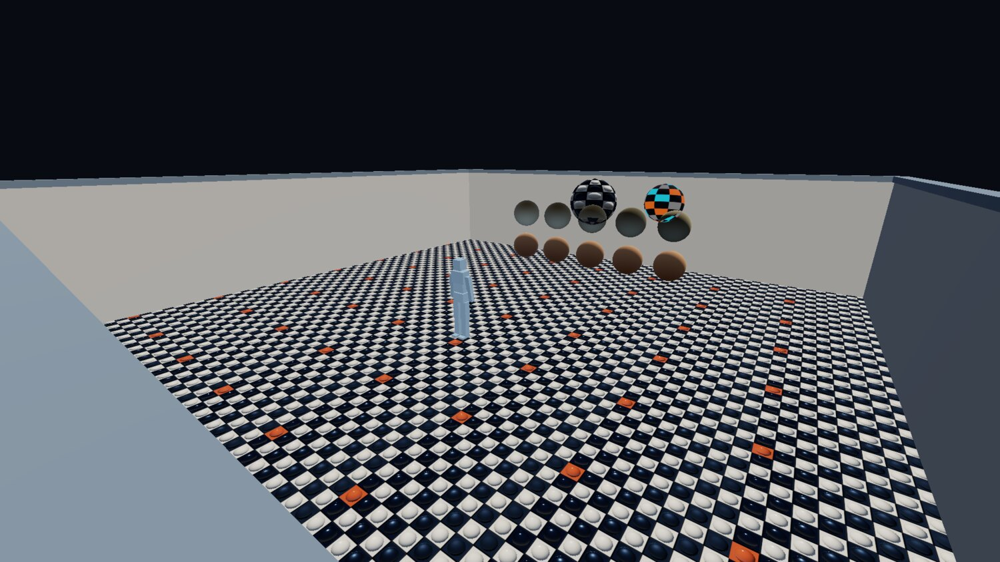
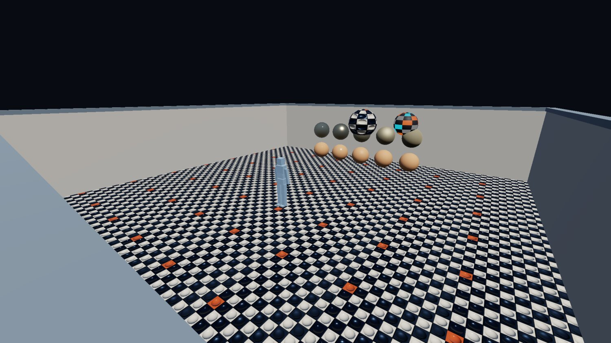

+++
description = "Building a game engine from scratch: six days of setup and nothing to screenshot."
tags        = ["c++", "gamedev", "engine", "sdl3", "claude"]
+++

# gg, week 1: something from nothing

@tableofcontents

## Introduction

**I've never been a game developer**. I've circled around it for years, though, having done everything from modding UT2004
as a teenager, all the way through working on experimental 3D graphics and physics projects as a researcher/engine developer
at a startup. Up until a few years ago these were the sorts of jobs I held professionally. That was until the job market
in that domain took a huge shit and forced me to jump ship, of course, forcing me to make the jump to space-tech at
[ICEYE](https://iceye.com) in 2023, serving as a 'Senior Flight Software Engineer'.

While this is a pretty cool job, the nature of it is obviously very different to my past work - much more embedded
systems-thinking, robust safety-critical processes, and long-term compatibility planning, and much less of the
'performance at any cost' and 'support all the things'-styles of programming you need to do in gamedev land.

**And boy do I miss it.** To that end, I recently decided it was time to dip my toe back in to that universe and take
on a hobby project to bring me back to my roots: build a game engine (and maybe even a full game) from scratch, using
as many of the current best-practices as I have time to learn about.

Problem is, the last time I built anything approaching a game engine _from scratch_ was way back in 2016 or so, and it was
architected around DirectX 10 first, then DirectX 11. Pretty much everything I know about drivers, shader compilation and
asset pipelines has gone stale since then, so the first part of this project is literally answering "where the heck
do I even begin?".

Enter Claude.

## The AI-shaped elephant in the room

It's at this point I'm most likely to lose readers, so I should clarify my position on AI.

Firstly: LinkedIn, Twitter, and probably your company's slack channels, are filled with fools making proclamations like
"Industry XYZ is dead! AI will replace it in 6 months!". Those people are all some combination of:

1. sociopaths
2. idiots
3. podcasters
4. salesmen

...and need to be launched into the fucking sun. Encouraging and/or celebrating the death of someone's livelihood is
supremely despicable.

So I'm not one of those, _ahem_, 'people'. I'm still heavily AI-skeptical. I think most of the hype is BS, and the
quality of the work AI produces is 'fine', **but only when guided by someone with the requisite expertise to do the work
themselves**. Sure, the tools will probably get better, but so too will the experts using them, so humans aren't going
anywhere. This layoff-happy trend we currently see is just a deferred shitstorm of regression-to-the-mean incompetence.

Secondly: I think the negative environmental and societal impacts of AI are going to be substantial, and the oligarchs
running these AI companies will have some serious explaining to do in the coming years.

That said, as a professional software engineer, I can't escape it. It's everywhere, infecting everything and everyone,
so I have to at least _try_ to get familiar with the tools if I want to stay employed (at least until I can get my bag
and go live in the woods), and this project is a way to do that.

Thus, in this project I'll be using AI to help me get back up to speed with current gamedev best practices,
as well as automating a bunch of the tedious development and debugging tasks I have already done thousands of times
over 25+ years of programming and really don't have the energy to repeat for a hobby project.

But I want to be clear:

@inline_attention **I am intentionally avoiding the use of AI-generated art in this project.**
<br><br>
As best as I can, assets used will either be (crudely) created by hand by me, or sourced from real human creators,
and paid/attributed accordingly. I believe that using AI for low-quality, throwaway placeholders a programmer
would traditionally cobble together themselves is fine (often called 'programmer art' for a reason), but using it
to generate higher-quality materials for real, shipped content, is just theft. Pay humans for their work.
<br><br>
To that end, I will list the sources of any externally-sourced assets at the bottom of each post.

## Early research

Fortunately for me I still follow a lot of key gamedev folks on Twitter from my past life, so an afternoon of digging
through their feeds, taking notes, and using Claude as google-on-steroids for some of the things I learned,
meant I was able to build up a pretty good corpus of current best-practices. Some of the biggest names among my research:

- [Glenn Fiedler](https://gafferongames.com/) - timesteps, determinism, physics, networking
- [Sebastian Aaltonen](https://x.com/SebAaltonen) - 3D rendering wizard
- [Omar Cornut](https://x.com/ocornut) - Creator and maintainer of [Dear ImGui](https://github.com/ocornut/imgui)
- [Arseny Kapoulkine](https://x.com/zeuxcg?lang=en) - Creator of [meshoptimizer](https://meshoptimizer.org/) and [luau](https://luau.org/)
- [Daniel Holden](https://theorangeduck.com/) - animation expert
- [Erin Catto](https://x.com/erin_catto) - physics, animation, creator of Box2D and Box3D
- ...and a whole bunch more

Collecting these learnings into a rough markdown document, as well as:

-  my own prior knowledge &amp; experience
-  a broad description of the sort of game I'd like to play
-  the scale of the engine that would be interesting to take on

Formed a good basis for Claude's `/plan` mode. After 20-or-so clarifying questions I had a plan, and the engine
and game project I'm cheekily calling `gg` was born.

## What I decided on

Since I have a loose idea for a proper game, but want to do little game-jams to push the engine in different ways,
I've chosen to build it as a clean engine/game split, where the game is a hot-reloadable binary and the engine is the 'host'.

The engine itself is going to be 3D and try to target some modern rendering techniques, but be largely biased towards
a simpler, stylized art style (as these are more in-line with what a solo developer can create/source on their own).

I game on Windows, but my day-to-day work has me using Linux and occasionally MacOS, so it should be cross-platform.
That means **[SDL3](https://www.libsdl.org/)** for the overall windowing and HAL abstractions,
**[Slang](https://shader-slang.org/)** for shaders (compiled offline to **[SPIR-V](https://www.khronos.org/spirv/)**),
**[Vulkan](https://vulkan.org/)** for the GPU layer.

While developing asset pipelines is fun, I've had my fill of it at this point in my life, so I'm not reinventing
any wheels there either. I'm supporting **[glTF](https://www.khronos.org/gltf/)** via
**[fastgltf](https://github.com/spnda/fastgltf)** for meshes and models (with some help from **[meshoptimizer](https://meshoptimizer.org/)**),
**PNG** for textures (cooked to BC4, BC5 and BC7 as necessary), **TTF** and **OTF** for fonts, and **WAV**, **FLAC**, **MP3**
and **OGG** for audio. These are all formats I've worked with before and am comfortable driving their various libraries
and tooling. I'll add more as the need arises.

For scene and game authoring, I'm just going to keep it simple and use **[Dear ImGui](https://github.com/ocornut/imgui)**
as the editor, running right over the top of the running engine itself as an edit-mode overlay (i.e. the game _is_ the editor).
I'm also a pretty advanced CMake user so I'll wire the asset cooking into that directly, so live re-cooking of assets uses the
same build system that the game's code does. The scene and gameplay logic will be backed by an entity-component system
using **[EnTT](https://github.com/skypjack/entt)**.

Other details: C++20, **[Jolt](https://github.com/jrouwe/joltphysics)** for physics (never used it before, though I hear
good things), **[reflect-cpp](https://github.com/getml/reflect-cpp)**, **[MessagePack](https://msgpack.org/index.html)**
and **[zstd](https://github.com/facebook/zstd)** for serialisation, **[toml++](https://marzer.github.io/tomlplusplus/)**
(my own library) for configuration, **[libfmt](https://github.com/fmtlib/fmt)** for text formatting,
**[spdlog](https://github.com/gabime/spdlog)** for logging, **[tracy](https://github.com/wolfpld/tracy)** for profiling,
and copious unit tests using **[Catch2](https://github.com/catchorg/Catch2)**.

So nothing very adventurous, deliberately so. The bits I actually want to spend my evenings on are
the iteration loop; everything else is a just a dependency to manage, and I do enough of that at my day job.

Two engine conventions got settled on day one because they're miserable to retrofit: fixed-timestep
simulation with interpolated rendering, and linear-space lighting with an sRGB-correct swapchain from the
very first textured triangle. Doing either of them later means touching everything.

## The plan

Broken up into broad phases of development, the initial plan looks like this:

| Phase | Description                                                                                                        |
| ----- | ------------------------------------------------------------------------------------------------------------------ |
| **0** | scaffolding - build system, compiler bits and pieces, dependency management, "just give me a window"               |
| **1** | game/engine boundary in place, with a hot-reloadable no-op 'game'                                                  |
| **2** | a basic scene with some materials, an animated character, and the simulation tick                                  |
| **3** | editor pre-requisites and low-hanging fruit - entity-component system, physics integration, and golden image tests |
| **4** | the editor                                                                                                         |
| **5** | proper asset cooking pipeline - cooked asset packs                                                                 |
| **6** | fleshing out the renderer                                                                                          |
| **7** | fleshing out the player controller and game 'feel' - interpolations, splines, camera handling                      |
| **8** | build a game                                                                                                       |

This is, of course, only a rough guideline. There is a lot overlap, there will be side-quests, there will be distractions,
there will be back-tracking. 

@inline_success **Pro-tip:** Keep a to-do list in your project's repository so you can dump various tangential side-quests
into it as you think of them. You'll stop yourself getting distracted, and you can point your AI tool of choice
at it later for quicker context when deciding on the next batch of work.

@inline_note **TL,DR**: There's no screenshots or videos for the first two phases. If you want see pretty pixels,
skip down to @ref blog_2026_08_09_phase_2_some_materials_and_a_character_in_a_box.

## Phase 0: scaffolding

The first part of the project is mostly just CMake, so not really very interesting to blog about.
A bunch of `FetchContent`, a bunch of `add_subdirectory`, and an `add_executable` with a `main.cpp`. Anyone
who's set up a new C++ project before has almost certainly done some version of this many times. 

What _is_ interesting is the scaffolding relating to Claude and and AI agents at this point. Since
a side-goal of this is to get more familiar with those tools, I made sure to try to 'do it right' from the
start, with a clear README.md, CONTRIBUTING.md and other documents written for (theoretical) human contributors,
as well as an AGENTS.md for filling in agent-specific blanks not covered by the other documents.

I won't paste a whole glut of that text here, but I will paste three snippets that ultimately turned out to
be worth the price of admission x1000. The first one was relating to debugging, since I knew I'd be leaning
on these tools a bit for things like rendering edge-cases:

> After every bug-hunting exercise: review the bug-hunt itself for anything that would have helped find the bugs faster.
> Rendering switches, debug outputs, command line arguments, log outputs, socket verbs, asserts, et cetera.
> Every debugging session should try to make the next one easier.

Sure enough, the very first time I pointed Claude at a problem I needed some assistance with, it did all the
normal investigations you'd expect, but also immediately followed that up with a post-mortem _on those investigations_,
offering suggestions on what to improve so the same investigation be more efficient next time.

Next was one relating to the general 'slop' nature of LLM code, since I knew what to expect from my exposure
to these tools via my job:

> After every batch of work: do a "slop" pass over your own contributions. We want to eliminate LLM voice, comment spam,
> unnecessary helpers and throwaway code, et cetera.

Combined with some specific examples of what sort of comments to write, what to omit, and what style of English to use.
This sort of thing is mandatory when working with these tools. Otherwise they write like first-year university students;
copiously commenting every little thing, unnecessarily narrating their choices, and just generally bloating the code
with expository nonsense.

Finally, a directive relating to scope:

> Do not implement a lesser version of a feature just because we're iterating on a "demo"; we are implementing a game
> engine, not a tech demo. Prefer the correct-at-scale choice over one that caters to a demo. If needs be, expand
> the demo rather than narrow the scope of an implementation.

This one I also knew would be necessary because of my experience with these tools at my job. If left to their own
devices they default to embodying the "efficient lazy programmer" stereotype in the most extreme sense, sticking
_exactly_ to the bare-minimum of the brief, whatever will make the test pass or make CI go green. Without it you'll see
hard-coded constants in tests, comments in code like "not needed at this scale", and various other lazy shortcuts.
Need to be vigilant about that from day one.

So for this phase writing the documentation and various build system scaffolding was more work than any C++ code was.
Ultimately Phase 0 took inside of half an hour to go from nothing to an empty SDL3 window initialized with Vulkan backend.

## Phase 1: game/engine boundary

The game is a shared library, and the engine is the host. The host owns the process (window, GPU device,
main loop, editor, file watching) and knows precisely nothing about the game beyond "a DLL at this path
exports these seven functions, and takes a struct of function pointers in return". The boundary between
the two is an 'hourglass waist', and it's C++ on both sides.

What crosses it is decided by layout. Every type in the header is standard-layout and trivially
copyable, so nothing on it owns memory, and every entry point is a `noexcept` function pointer, so a
throwing implementation fails to compile instead of unwinding into the other module. Both sides are built
from one header by one toolchain, so a namespace, a scoped enum and a string view cost nothing, and the
whole thing reads as ordinary house style. The seven exports keep C linkage, since the host resolves them
by literal symbol name at load, and that is all the C there is.

There's a purist version of this, with prefixed structs in the global namespace and nothing C++-shaped
allowed across at all, and for a C++ codebase where both sides are always the same author it's
over-engineering. Layout is the only thing the two sides have to agree on.

The engine's half of it is a versioned, append-only table of services, which at this point is a logger and
a way to set the clear colour, because that's all a no-op game needs. The whole waist, minus the export
macros and attributes:

```cpp
namespace gg::api
{
    enum class log_level : int32_t
    {
        debug,
        info,
        warning,
        error,
    };
  
    struct engine_api
    {
        uint32_t size;
        uint32_t version;
        double tick_dt;
        void* ctx;
        void (*log)(void* ctx, log_level level, std::string_view message) noexcept;
        void (*set_clear_colour)(void* ctx,
                                 float r,
                                 float g,
                                 float b,
                                 float a) noexcept;
    };
}

extern "C"
{
    uint32_t gg_game_api_version() noexcept;
    uint64_t gg_game_api_digest() noexcept;
    void* gg_game_init(const gg::api::engine_api* api,
                       void* arena,
                       uint64_t arena_size) noexcept;
    void* gg_game_on_reload(const gg::api::engine_api* api,
                            void* arena,
                            uint64_t arena_size,
                            void* state) noexcept;
    void gg_game_tick(void* state) noexcept;
    void gg_game_render(void* state, float alpha) noexcept;
    void gg_game_shutdown(void* state) noexcept;
}
```

Hot reload is then mostly bookkeeping. The engine watches the module's timestamp (with a debounce, since
the linker writes in place and you don't want to load something half-written), copies it to a numbered
temp name so the linker can overwrite the original on Windows, loads the copy, and rebinds. If anything in
that chain fails it keeps the last good code and says so in the console.

Game state lives in a 64 MB arena the engine owns, so it survives the swap. The freshly-loaded module gets
handed the old state pointer and can either resume the session or declare the surviving state incompatible
(there's a size and version stamp at the front of it), in which case the host starts a fresh one. A swap
takes about 18 ms, so roughly a frame.

Some rules were in the plan from day one, because they're the kind of thing you only get right if you
decide them before there's any code around to violate them:

- game state lives in engine-owned memory, and the game only ever gets an opaque pointer to it back
- hot state is POD-ish; no vtables and no function pointers into the DLL, since both dangle after a swap
- ECS state is snapshotted across a reload through the same serialisers the scene files will use
- polling over callbacks; the engine never holds a game function pointer, the game polls engine queues instead

That last one is slightly less elegant than callbacks, but deletes an entire class of reload bugs, which is a
trade I will make every single time.

There was briefly a static-link mode for shipping builds as well. It got deleted. The waist is a table of
function pointers either way, so static linking had nothing to win (no cross-boundary inlining to enable)
and cost a second build topology to keep green, and I can't afford that many GitHub Actions minutes.
The game is always a shared library now, and dev and shipping builds differ only in whether the host's
default is to watch it.

The other thing that landed here was the clock, since it's the other retrofit-hostile decision from the
list above. It's [Glenn Fiedler's fixed timestep](https://gafferongames.com/post/fix_your_timestep/),
straight from the article: the sim advances in whole 60 Hz ticks off an accumulator, the leftover fraction
is the interpolation alpha the renderer uses to blend between the last two sim states, and a hitch is
clamped to five ticks so one long frame can't spiral into a longer one.

The accumulator is its own tiny type with its own unit tests, so this mechanism has 100% test coverage from day one.

```cpp
uint32_t sim_clock::advance(nanoseconds frame_dt) noexcept
{
    accumulator_ += std::max(frame_dt, 0ns);

    uint32_t ticks = {};
    while (accumulator_ >= interval_ && ticks < max_ticks_)
    {
        accumulator_ -= interval_;
        ticks++;
    }

    accumulator_ = std::min(accumulator_, interval_ - 1ns);
    return ticks;
}
```

The tests run the engine in 'headless' mode, so no front-end, no window, no VSync etc, so there sim ticks exactly once
per frame, which is what makes those tests deterministic.

Next came Dear ImGui (the docking branch): a dockspace, a console fed by an `spdlog` ring
sink, and a stats panel with frame times, the sim tick and the reload count. The demo 'game' itself at this point
was just a tick counter and little else. It did cycle the clear colour through the hue wheel for a while, which was a
nice proof that the interpolation alpha made it through the waist, but very quickly became annoying to look at.

All of this was written into the plan document before any of it was written in C++, and that's been the
working pattern ever since: I make a decision, the decision and its reasoning go into the plan, and the plan
is what Claude works from to build out the first version of the feature. Every session starts by reading it.
It's also where the gotchas end up, in the section where the next session will trip over them, which is the
debugging directive from Phase 0 applied to documentation.

## Phase 2: some materials and a character in a box

Finally, a screenshot!



_The first nontrival rendered content. The spheres are drawing their backfaces and the colours are flat, but still, it's something._

Shader compilation went in first, and deliberately so, because it was the pilot for the whole asset cooking
pipeline. Slang's compiler comes down as a prebuilt binary through the same dependency machinery as
everything else, and each `.slang` file cooks to one SPIR-V module through a CMake custom command with
the compiler as a dependency and a depfile of everything the compile actually read. Ninja folds the
discovered includes into the incremental build natively; it's the C header problem, and the same solution
works.

Outputs cook to a staging directory and get published by rename, so the running engine can only ever see
a whole file appear. Per shader, that's two custom commands:

```cmake
add_custom_command(
    OUTPUT "${staged}"
    COMMAND slang::slangc "${source}"
        -target spirv
        -profile spirv_1_3
        -matrix-layout-column-major
        -warnings-as-errors all
        -o "${staged}"
        -depfile "${staged}.d"
    DEPENDS "${source}" "$<TARGET_FILE:slang::slangc>"
    DEPFILE "${staged}.d"
    VERBATIM
)

add_custom_command(
    OUTPUT "${output}"
    COMMAND "${CMAKE_COMMAND}" -E copy "${staged}" "${output}.tmp"
    COMMAND "${CMAKE_COMMAND}" -E rename "${output}.tmp" "${output}"
    DEPENDS "${staged}"
    VERBATIM
)
```

That pattern above will serve as the template for the whole asset cooking pipeline, because it generalizes beyond shaders.
CMake and Ninja already do these incremental integrations extremely well if you know how to wire them up, so no sense
in reinventing that wheel.

The engine runs `cmake --build` itself. While the window is unfocused it scans the source tree every 250 ms
(about a millisecond for the whole tree, against thirty-odd for a no-op ninja invocation), and if anything relevant
changed it kicks off a build as a child process that's polled once per frame, so the frame loop never blocks on it.
Once the build completes successfully, the file watcher machinery detects that the game's binary has been updated
and swaps it out on-the-fly.

Only the hot-swappable targets get built this way. The engine library and the host are already loaded
into the process, so rebuilding them can't take effect, and on Windows the link would fail outright anyway.

So the loop, as of the end of the first week:

| Edited                      | Result                                                |
| --------------------------- | ----------------------------------------------------- |
| `source/game`               | rebuilt, then hot-swapped; the session survives       |
| `assets/shaders`            | recooked, then the affected pipelines are recreated   |
| `assets/models`, `textures` | staged, then every model that read them is reimported |
| `source/gg`, `include/gg`   | not built by the engine at all; restart to pick it up |

A model's watch list is whatever files it actually read, so editing a texture reloads the models that
reference it without anything having to declare that relationship.

The rendering itself is pretty textbook: glTF via fastgltf into one vertex/index buffer pair per file and a draw
per node-primitive, metallic-roughness materials, **[Cook-Torrance GGX](https://graphicscompendium.com/theory/08-cook-torrance-ggx)**
with [Smith visibility and Schlick fresnel](https://filmicworlds.com/blog/combined-approximation-of-fresnelvisibility/),
one directional light and a hemisphere ambient standing in for image-based lighting, since there's no content
for IBL just yet. That's a very well-trodden path, though, so I have lots of material in the research corpus to draw on.

The part that needed care was the colour management, so this is the bit I was pedantic about:

- base colour and emissive textures upload as sRGB formats, so the sampler hands the shader linear values
- metallic-roughness and normal maps upload as plain UNORM, because their contents aren't colours
- the scene renders into a 16-bit float linear target
- a tonemap pass applies exposure, an [ACES fit](https://knarkowicz.wordpress.com/2016/01/06/aces-filmic-tone-mapping-curve/), and an explicit linear-to-sRGB encode into an 8-bit target
- that target is blitted to a non-sRGB swapchain, because Dear ImGui draws in sRGB space and an sRGB
  swapchain would encode it a second time; the engine warns if it's ever handed one

Get this wrong and you have the classic amateur-renderer defect: gamma-space lighting
that the content then compensates for, at which point it's unfixable without redoing all of the art. It's
nearly free on day one and misery to excavate later, which is why it was on the day-one list.

@inline_attention **Seriously.** I had to fix all of the above in an already-established engine some years ago, and
it was a huge pain in the ass. You want to get this right from the very beginning.

The end of the pipe, in Slang. Narkowicz's ACES fit, then the encode, applied by hand because the target
is a plain UNORM texture:

```hlsl
float3 tonemap(float3 colour)
{
    colour *= 0.6;
    const float3 mapped = (colour * (2.51 * colour + 0.03))
                        / (colour * (2.43 * colour + 0.59) + 0.14);
    return saturate(mapped);
}

[shader("fragment")]
float4 fragment_main(tonemap_output input) : SV_Target
{
    const float3 scene = scene_texture.Sample(input.uv).rgb;
    return float4(linear_to_srgb(tonemap(scene * exposure)), 1.0);
}
```

The emissive checker texture even has a mid-grey cell in it purely as a tripwire. If it ever gets read as
linear it comes out more than twice as bright, which no amount of squinting at a glowing colour would ever
tell you.

Two more things landed here that paid for themselves within days. Offscreen rendering with a PNG readback
(`gg --screenshot out.png`, no window), and a synthetic-time mode where the sim advances exactly one tick
per frame, wall clock ignored, so a given frame count produces byte-identical output every time.
Screenshots are scene-only by construction, since the editor UI composites in its own pass afterwards. That
combination is what makes committing baseline images possible, and Phase 3 opens with exactly that.

And then the character. Skins and clips load alongside the static geometry, joints get reordered
parents-first at load (glTF only recommends it) with the vertex joint indices remapped to match, so a pose
resolves in one forward pass. Skinning is on the GPU with the joint matrices in a uniform slot, capped at
64 joints.

The walk clip's playback rate scales with ground speed so the feet don't skate, and an over-the-shoulder
camera rig arrived with it, with F2 toggling between that and the fly-cam. Movement is kinematic for now,
though.

Underneath both cameras is the input action-mapping layer: named actions with string-form bindings,
press/release edges, per-frame axis accumulation, and raw scancodes never leaving the engine. Transform
gizmos via ImGuizmo and an asset browser with PNG previews and reimport-on-save rounded the phase out, and
that's about the point where it started feeling like an actual tool.

## Phase 3: the invisible part



_Spot the difference._

Phase 3 is where most of the decisions that shape the rest of the project got made, and almost none of
them show up in pixels.

It started with dependency wrangling, because none of the phase's new libraries could be trusted with
their own CMake. Jolt calls `find_package(Vulkan)`, forces `-fno-rtti` (which is a hard link failure
against a debug renderer subclass) and pushes its own `-march` flags at you as PUBLIC, which would
silently raise the ISA floor on older hardware. EnTT's calls `project()` and wants CMake 3.28.
reflect-cpp turns its vcpkg submodule on for any format other than JSON and then goes looking for it.
msgpack-c's exists only to install things.

I deal with these sorts of build system crimes at my day job all the time, so this was just more of the same.
It just meant they got their own hand-crafted recipes instead of trusting their CMake to behave via `add_subdirectory()`.
Par for the course in the clusterfuck that is the C++ build landscape, really.

### Golden image baselines

If you have a project that does any sort of rendering, you want to establish this as part of your tests
as early as you possibly can: tie your renderer into your tests, with the possibility to bless 'golden' images
as proof that everything is working correctly. As your renderer grows in capability, so too does your
golden image corpus. This is absolutely critical to making sure a change in one part of a pipeline doesn't
introduce strange and interesting downstream effects far away somewhere else.

So here's where that went in, with the image at the top of this section becoming the first 'golden'.
Every renderer change from here on is guarded by it, plus others that get added later. The demo scene renders offscreen
at 1920x1080 for a fixed frame count and gets compared against a committed baseline, with two thresholds,
because there are two ways to break an image.

An image comparison is only worth anything against a fixed rasteriser, so the tests pin themselves to
Mesa's software Vulkan device (`lavapipe`) and skip, loudly, when it isn't installed. The same frame off my
NVIDIA driver and off lavapipe can differ in 2% of pixels by more than 16 levels per-channel, which is far bigger
than any regression worth catching. Controlling for this just by sticking with the software rasterizer is the
only sane choice here.

@inline_success **Pro-tip:** If you implement a system like this, be sure to **actually look at the difference** between
old and new goldens if you need to regenerate them. Bake comparsion thresholds into your tests so you can absorb drift between 
rasterizer versions beyond your control, but don't trust them blindly; use your eyes, too. Also be sure to keep your
thresholds as tight as possible; widening them to get a regression past CI is cheating, and you will pay for it later.

### Entity-Component System

The entity model is EnTT, owned by the engine, with the registry kept inside a single translation unit.
The plan originally had the registry living game-side, and Phase 3 could not be built that way: the scene
has been engine-owned since Phase 2, the editor is engine-side ImGui, and the game module can't see imgui
at all. The cost is that game-defined components are impossible for the time being, which is written down
in the plan so it gets paid for deliberately when a game actually needs them.

Components are plain aggregates, and one registration layer serves three consumers: MessagePack
serialisation via reflect-cpp's field reflection, a generic ImGui inspector that walks the same reflected
members and picks a widget per type, and EnTT snapshots for hot reload. Registration is a type list with a
name and a persistent-or-transient flag per component, so the per-component code is basically nil. A new
component costs its own struct, a traits specialisation naming it, and a slot in the list:

```cpp
template <>
struct component_traits<components::transform>
{
    static constexpr std::string_view name = "transform";
    static constexpr bool persistent       = true;
};

using registered_components = type_list<components::persistent_id,
                                        components::name,
                                        components::model,
                                        components::transform,
                                        components::previous_transform,
                                        components::animation,
                                        components::character_controller>;
```

EnTT's own meta system lost out here. It wants a hand-written line per field, which is exactly the
boilerplate reflect-cpp exists to delete, and it costs about 220 ms of header parsing in every TU that
touches it.

Every entity carries a minted uuid, and the runtime EnTT handle is never persisted anywhere. Saves, scene
cross-references, the socket and (later) undo all address entities through the uuid.

### A saved scene file

A scene file is a version plus a list of records, each one a uuid and a sorted map of component-name to
msgpack blob. Records sort by uuid, so identical content saves to identical bytes regardless of the
registry's creation history, and a component key the running build doesn't recognise rides through a
load-and-save untouched.

That's the whole save architecture in embryo. A save lives for years on someone's disk and has to load in
a patched game, so identity and forward-compatible encoding had to be right while the component set was
still tiny enough to change cheaply.

This is also where the first real library gotchas got recorded. The plan's rule is that a gotcha gets
written down where the next session will trip over it, and this phase produced a bumper crop:

- reflect-cpp's msgpack backend errors on a missing key even for optional and defaulted members, contrary
  to its docs (which describe the JSON backend). Every read passes `DefaultIfMissing`, because without it
  the first field added to a component breaks every existing file, and what you see is a corrupt file
  with nothing pointing at the schema.
- nothing serialised may use an unordered container, since bucket order makes identical content produce
  different bytes, and byte-deterministic saves are the whole point.
- reflect-cpp's field visitor happily recurses into libstdc++ internals, so a naive walk renders a
  `std::array` as `_M_elems`. The inspector's visitor checks an explicit terminal-type list ahead of its
  aggregate fallback.
- EnTT's `try_get` doesn't compile for an empty tag component, and the failure is a hard error inside a
  variadic fold.
- Jolt's allocator hooks have to be installed before any Jolt object is constructed, its temp allocator
  included, so a member initialiser runs too early and segfaults.

### Jolt physics integration

Speaking of Jolt: static bodies are cooked from each model's triangles with the world transform baked in
(Jolt bodies carry no scale), and the player is one virtual character with a capsule sized off the model's
bounds. No rigid body dynamics are stepped at all, deliberately.

The collision shapes draw as wireframes on ImGui's background draw list, which keeps them out of the
renderer and out of the golden images, and Jolt's CamelCase house style is contained behind an
engine-owned header so it never leaks into the rest of the codebase.

### Viewports and input

Viewport picking is a CPU ray against the models' triangles, with the per-draw bounds as the only
broadphase, so a click costs a few thousand Moller-Trumbore tests at this content scale. The skinned
character picks against its rest pose, and the selection outline draws over scene geometry because an
overlay has no depth. Both are probably fine for now, and both are written down as caveats.

The input replay tool records the initial scene, every tick's input struct, and a digest of the persistent
state every 60 ticks, then replays the lot from the recorded start and compares digests as it goes.
Everything the sim is allowed to know about a tick, and everything a recording holds:

```cpp
struct tick_input
{
    float move_x = {};
    float move_z = {};
    float yaw    = {};
    bool sprint  = {};
};

struct replay_recording
{
    static constexpr uint32_t current_version = 1;

    uint32_t version = current_version;
    scene_file initial;
    std::vector<tick_input> ticks;
    uint32_t checkpoint_interval = 60;
    std::vector<uint64_t> checkpoints;
};
```

It's there for bug reproduction, officially. The more valuable thing it does is prove, continuously, that
the sim is pure: a divergence means the tick read something that wasn't in the input struct (the wall
clock, a device, some editor state), and that shows up as a failed digest years before it'd matter for
anything else.

The determinism scope is same binary, same toolchain, same machine. Contracted FMA and libm see to that,
and it costs nothing the tool's actual jobs need.

### The command socket

Oh boy. The command socket. The single decision from this first week that I'd keep if I could only keep one.
Originally it was an afterthought, a fun little mental exercise of "mmm since the editor history is already stack
of serialized commands for undo/redo purposes, what if you could send those commands to it from another program?".

This turned out to be a very consequential thought experiment. Recall earlier my `AGENTS.md` guidance about
"make each debugging session easier than the previous one"? Turns out if you give Claude that directive, and the
ability to drive your engine completely headlessly and remotely, pretty soon it's debugging more than just
your code, but driving full editor loops, renderer components, input, the works. 

Implementation is pretty straightforward. It's a loopback TCP socket, on by default but in dev builds only, speaking
length-prefixed MessagePack, polled once per frame on the frame loop so there's no thread and no engine state is ever
reachable from one. The verb set at the beginning is very small: `ping`, `list-entities`, `get-entity`, `select`,
`save-scene`, `load-scene` and `screenshot`, but as you'll see in later posts, eventually grows significantly.

The observation verbs turned out to be worth a lot more than the mutation verbs, which I didn't expect at
the time, and which next week's post is mostly about.

## Where it stands

After the first week I have a window, a fixed-step loop, hot reload of game code, shaders and models,
cooked shaders on the build graph, a textured PBR renderer with a tonemapper, a skinned character 'walking'
around a box on a Jolt capsule, an entity model with reflection-driven serialisation and an inspector,
persistent identity, a replay tool, golden image tests, and a socket. 182 test cases across 28 files,
all but the golden images headless, and a CI matrix of GCC, Clang and MSVC with a sanitiser job.

What there isn't: an editor that actually meaningfully edits things, cooked assets apart from shaders,
shadows, a sky, or a demo scene that's anything other than pure programmer art.

Next week the editor gets undo you can audit, the asset pipeline stops being a pilot, and the renderer gets
a look. It's also the week I pointed Claude at that socket and told it to build me a village, which turned
up four engine bugs that had been there since the first frame loop.

## Credits

At this point the only third-party asset I'm using is the editor's fonts, which are [Inter](https://rsms.me/inter/)
by Rasmus Andersson and [JetBrains Mono](https://www.jetbrains.com/lp/mono/), both under the SIL Open Font License
(though neither appears in the above screenshots).
