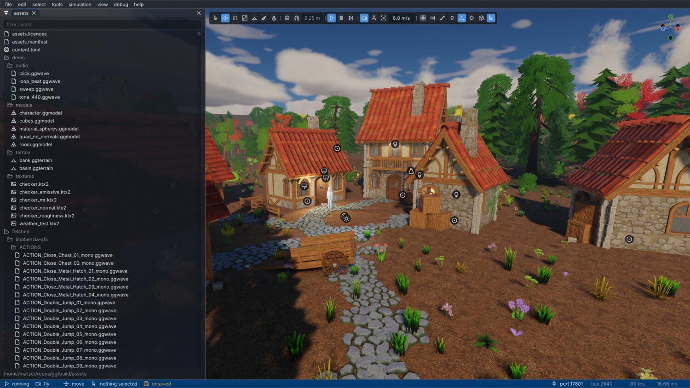
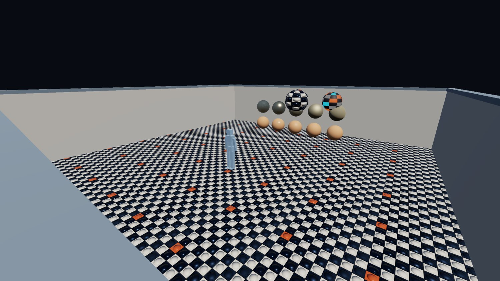
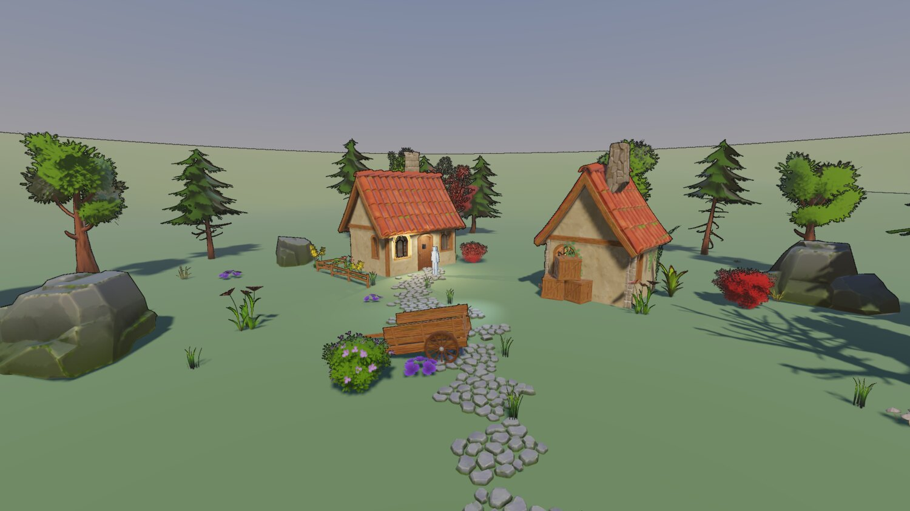
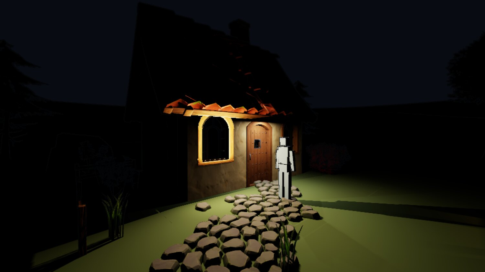
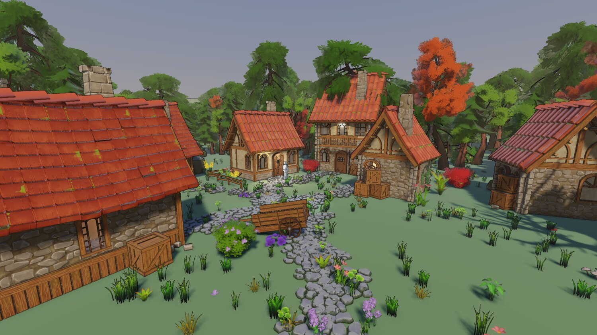
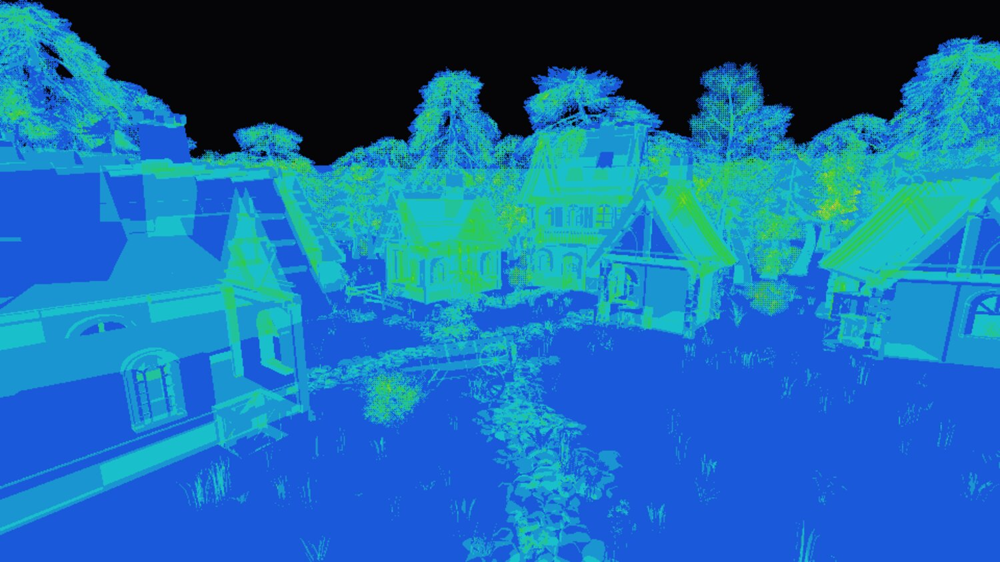

+++
description = "Undo you can audit, an asset pipeline on the build graph, clustered forward lighting, and what happened when I let Claude drive the editor."
tags        = ["c++", "gamedev", "engine", "rendering", "tooling"]
+++

# gg, week 2: an editor, a cooker, and letting an agent drive

@tableofcontents

Week one ended with a fixed-step loop, a renderer that could draw a box, and a socket. This week was
about turning that into something I could actually author content with. It was also the week where the
bottleneck stopped being how fast I can type and became how well I can describe what I want, which is a
very different problem, and one I'm still getting used to.

Four commits: the editor, the asset pipeline, the renderer, and then a fifth thing I hadn't planned on
at all, which was pointing Claude at the socket and watching what broke.

## An editor you can trust

Content authoring starts in earnest next week, so before that the editor needed to go from "pokeable" to
"trustworthy". I'd written that ordering down in the plan before doing any of it, mostly so I wouldn't
talk myself into skipping ahead to the shiny rendering stuff.

The main rule: no panel writes to a component directly. Every mutation goes through one edit facade.
This isn't a style preference. Undo is record-based, so a write that bypasses the facade is invisible to
it, and an undo stack that's right 97% of the time is worse than no undo at all, because you stop
trusting ctrl+Z and start saving compulsively instead. Anyone who's used an editor like that knows the
feeling.

Undo itself is a list of incremental change records, `(persistent id, component name, before blob, after blob)`,
serialised through the same MessagePack machinery the scene format uses. An absent blob means an absent
component. I did briefly consider whole-scene snapshots, and skipped them.

The bit that makes it trustworthy is the audit test: capture the scene, make an edit, undo it, capture
again, compare bytes. Any difference means the edit wasn't recorded properly, and the test says so
immediately, instead of me noticing a wrong-looking viewport a week later and having no idea which edit
did it.

The rest of the editor work was the boring-but-necessary stuff: ImGui widget IDs seeded off entity uuids
so a re-ordered list doesn't carry widget state across rows, an action-map context stack so the fly
camera stops steering while you're typing in a text field, rolling autosaves, and per-panel error
recovery so one panel throwing doesn't take the whole frame down with it.

_The editor. This screenshot is a more recent one, so it's flattering week two with a fortnight of extra polish._

## The cooker stops being a pilot

Shaders have been cooking through CMake since week one, and this week everything else joined them:
textures to BC7 and BC5 with offline mips in a KTX2 container, meshes into a quantised interleaved
layout via meshoptimizer's mandatory stage order, animation clips unrolled and resampled to a fixed
60 Hz with per-joint velocities, plus a virtual filesystem with an ordered overlay of mounts over the lot.

The rule for all of it is that loading a cooked asset is I/O plus fixup, never parsing. Everything
expensive happens at cook time, and the blob's on-disk layout is the in-memory layout.

Asset identity is the part I care about most, because it's the part that bites you years later. Every
source asset gets a uuid minted the first time the cooker sees it, never derived from its path, and
recorded in a per-folder `assets.toml` that lives in version control. The reasoning: a save file records
which building asset stands where, so path-derived identity would break every save the first time
somebody renamed a folder. Reconciliation is path-first and hash-second, so a moved file keeps its
identity, a copied placeholder doesn't steal the original's, and a deleted asset gets a tombstone so its
uuid is never reused.

The cook cache key is the source hash, every discovered input, the importer's identity, the sidecar
settings, the cooked format version and the target profile. Importer identity is the cooker binary's
own hash, so there are no per-importer version constants for me to forget to bump. Change the code, the
compiler or a pinned library, and every key moves.

This is also the week the source tree got split into proper libraries: a vocabulary library, the
on-disk formats, the cooker, an SDL leaf, the developer-only halves, and the engine. One header, one
owning library, and no duplicated file stem anywhere in the tree. A collision fails the build (with
exactly one recorded exception, because of course there is).

## The look

_11 August. Shadowless, skyless, and lit by one directional light and a hemisphere ambient._

_13 August. Shadow map, MSAA, sky, fog, and enough content to tell whether any of it works._

The order these went in wasn't really up to me; each one is a prerequisite for the next.

Shadows first. A shadow map is the single biggest image-quality lever there is, and the first playable
is going to be a greybox where the whole question is whether a ledge reads at a glance from below, which
an unshadowed greybox simply can't answer.

MSAA next, and deliberately ahead of sampleable scene depth, because multisampling changes what that has
to be. The depth buffer never resolves, and SDL_GPU can't sample a multisampled texture at all, so the
resolve has to go ahead of the tonemap and every screen-space effect needs its own single-sample
distance attachment. If I'd done depth first I'd have plumbed the wrong representation through
everything and then ripped it out again.

Sky before fog, because fog fades into the sky, and fog fading into a flat clear colour is work you
throw away.

Then the demo scene grew some terrain, because you can't tune fog inside a 25 metre room. The fog
density was immediately wrong by an order of magnitude, and the terrain also flushed out a shadow bug
that had been there since the shadow map landed: anything past the shadow fit's far plane was reading as
fully shadowed, when what "past the far plane" actually means is "out of range". In a room that's
unreachable. On open ground it's a hard line at the shadow distance that follows the camera around.

And it was baked into the golden baselines, too. A baseline only guards the cases its scene can pose,
and the scene was a room. Annoying.

## The lantern that lit the outside of its own walls

Point and spot lights went in as a first cut: a forward loop over a fixed array of 16, a nearest-N
heuristic to pick which 16, no new pipeline, and no shadows.

That lasted about an hour. A lantern inside a room lights the outer faces of its own walls, because a
punctual light with no shadow map is occluded by nothing. Deferring shadows was arguably defensible for
the outdoor content the roadmap had been written against, but for an interior it's just wrong, and the
first thing anyone does with a lantern is put it inside a building.

So the lighting got rebuilt properly in the same week: clustered forward, lights in a storage buffer with
no cap, a froxel grid built in the renderer's first compute dispatch, per-cluster light index lists out
of one shared budget allocated by an atomic, and a shadow atlas with tile sizes chosen by screen radius.
Area lights came with it, via linearly transformed cosines, with the tables fitted in-repo against this
engine's own GGX. (I could've vendored somebody else's tables, but then they'd be an approximation of
somebody else's BRDF.)

Clustered forward is a slightly unfashionable choice in 2026, but it falls straight out of two decisions
I'd already made: MSAA has to survive, and forward has to stay. Reject deferred and this is what you end
up building.

_Punctual lights with shadows, and the same shading response as the sun. A lantern shading smoothly
next to a stylised, banded sun made it fairly obvious the look was splitting in two._

## Letting an agent drive

The socket exists so external tools can drive the editor. I'd been assuming the interesting client would
be a Python script. Turns out it isn't.

I gave Claude the socket, an empty scene, and this:

> From a completely empty scene, build me a dense forest with a path cleared through the trees leading to
> a small village with 2-3 houses. Don't do it in offscreen mode, I want to watch the editor being driven.
> As you build, take note of what is difficult about the process so we can refine it.

Three of these drills are up on YouTube, in a playlist I've started calling
[Claude as a gamedev](https://www.youtube.com/playlist?list=PLRuhlguCOFiE). The third one is shorter
because I told it to be quicker, and it was.

@tabs

@tab{Drill 1 (15 min)}

@youtube{QGV6e1td9mg,Claude as a gamedev #1}

@tab{Drill 2 (18 min)}

@youtube{hKNWNNygkHY,Claude as a gamedev #2}

@tab{Drill 3 (10 min)}

@youtube{FlJr9CI09jQ,Claude as a gamedev #3}

@endtabs

The village itself was a pretext. What I actually wanted to know was what driving the editor blind
costs, and the very first run turned up four engine bugs that had been there since the beginning.

First: the socket died whenever the window was obscured, and said nothing about it. The poll rides the
frame loop, so when the loop parked, everything riding it starved together: socket, file watch,
rebuild-on-demand, autosave. The listener kept accepting connections, so from the client's side it was a
silent timeout. That's about the worst failure shape available, and it's also the normal case, since a
human supervising an agent is by definition looking at a different window.

Finding where it was parking took three goes, and the two wrong guesses were the plausible ones. It
wasn't the swapchain acquire; making that non-blocking just moved the stall somewhere else. It wasn't
the window flags either, because SDL's Wayland backend never sets `SDL_WINDOW_OCCLUDED` here at all
(thanks, Wayland). It was the present. SDL_GPU presents inside `SDL_SubmitGPUCommandBuffer`, the default
present mode is vsync, and vsync blocks for exactly as long as the compositor feels like declining the
surface. I measured 17.7 s and 23.3 s. Lovely.

Fix: mailbox present plus a frame limiter against the display's refresh interval. An obscured window now
answers the socket in 0.4 to 5 ms at 19% of a core. Much better. The thing that actually found it was
instrumenting every GPU call in the frame to say which one blocked and for how long, and that's stayed
in as a permanent diagnostic, per the AGENTS.md directive from week one.

Second: nothing could tell it how big an asset was, so Claude parsed the glTF files off disk to work out
tree heights and origins, despite every one of those facts already sitting in the cooked bundle.
`describe-asset` answers that now, and reports bounds as a min and a max: where the origin sits inside
the box is the half you can't derive from a size, and it's the half that decides whether a thing stands
on the ground or hovers above it.

Third: nothing could say where the ground was either, so it reimplemented a heightfield sampler in
Python. Adding `raycast` and `drop-to-ground` to fix that found the bug underneath: the scene's spatial
index was being maintained inside `build_render_items`, behind the renderer's own gate, so in a headless
session it didn't exist at all.

And fourth: the only way to rotate anything was with a raw quaternion. Claude ported the engine's own
facing function into Python, got a cross product backwards, and aimed the sun upward from underneath the
terrain. Nothing complained. `set-transform` takes euler angles or an aim vector now, and a sun pointing
up warns once.

The later runs found subtler things, all with the same shape: a verb that exists but answers the wrong
question. A point query where a region was wanted, so finding one clear flat patch took 1681 raycasts. A
singular where a list was wanted, so creating 300 entities was 300 undo records and backing the whole
pass out wasn't a single undo. An empty response where the new state was wanted, so every camera write
had to be followed by a read.

@inline_success **Pro-tip:** The question to ask of any tool verb isn't "can it do the thing", it's
"what does it cost the caller to ask". Every one of those verbs worked. They were just expensive to use,
and a client that can't see the screen pays that cost in full.

The general lesson was blunter than I expected: an agent makes a good test instrument precisely
_because_ it can't squint at the screen and work out what went wrong. The occluded-window hang had been
there since the first frame loop and the empty headless index since the picker landed, and neither
surfaced until something drove the editor hard enough, and blind enough, to hit them.

## What the village cost

_17 August. Two houses in a clearing became seven buildings in a wood._

The village the drills built is what pulled LODs and instancing forward on the schedule, and it moved
the numbers a lot: 156 entities to 1700, 1.24 M triangles, 547 draws, and the frame from 2.00 ms to
5.45 ms at 1080p. The golden image suite went from 66 s to 134 s on lavapipe, which is just the standing
price of having content worth testing against.

It also saturated the shadow atlas. Tile size is a screen-radius rule with a per-tile cap, and a cube
light pays for six tiles, so one lantern four metres from the camera claimed 6.29 M texels of the
16.78 M available, 37% of the atlas, and three of the ten lights ended up with no shadow at all. So:
light through the walls they were standing inside. Again. For a completely different reason this time.

The measuring that came with the LOD work is the part I'd actually keep from this section.

Deleting a class of content and re-measuring said a tree cost fourteen times what an undergrowth clump
did, which I read as "triangle-bound", obviously. Nope. Halving the submitted triangles moved the aerial
frame by half a millisecond; halving the pixels moved it by twelve; collapsing 5644 draws into 169 moved
it by five. The fourteen was screen coverage dressed up as a triangle count.

Lesson: a per-entity cost from a delete-and-remeasure sweep tells you the entity is expensive and
nothing about why. The second measurement, changing one thing with everything else held, is the one
that names the cause.

_The overdraw view. This had to exist before I could judge the front-to-back sort at all. Shaded
fragments fell 22% and frame time fell 22%, which says this renderer costs about 1.2 to 1.4 ns per shaded
fragment and not much else._

And one bug in the measurement harness that was worth more than the result it was measuring. The first
A/B reported 760 ms eye-level frames, because it was sampling the first frame after every camera move,
and in a dense forest that means a full shadow atlas redraw. A real 50x hitch, which nothing had ever
named, found only because a script happened to sample exactly that frame.

## Where it stands

|                     | source | tests  | docs   | shaders |
| ------------------- | ------ | ------ | ------ | ------- |
| 9 Aug, phase 3      | 18,703 | 5,673  | 14,548 | 343     |
| 11 Aug, phase 4     | 24,438 | 7,978  | 15,144 | 343     |
| 11 Aug, phase 5     | 33,244 | 11,024 | 16,154 | 412     |
| 13 Aug, phase 6     | 44,366 | 13,752 | 19,663 | 1,477   |
| 17 Aug, phase 6.5   | 54,725 | 19,066 | 22,567 | 2,365   |

_Line counts._

So two weeks in: an editor with undo I trust, an asset pipeline on the build graph with minted identity,
clustered forward lighting with shadows and area lights, and a scene with enough stuff in it to be worth
measuring.

The ground is still a mesh baked from a sine function by a Python script, though, and the sky is a
gradient with no idea what time it is. Both of those are next week's problem.

## Credits

Everything in these shots that isn't engine is bought or borrowed:

- The buildings, props, trees, foliage and rocks are [Quaternius](https://quaternius.com/) kits: the
    Medieval Village and Stylized Nature MegaKits, bought as the paid source versions, plus the free
    Ultimate Stylized Nature set. All of it is released CC0, and he takes Patreon support.
