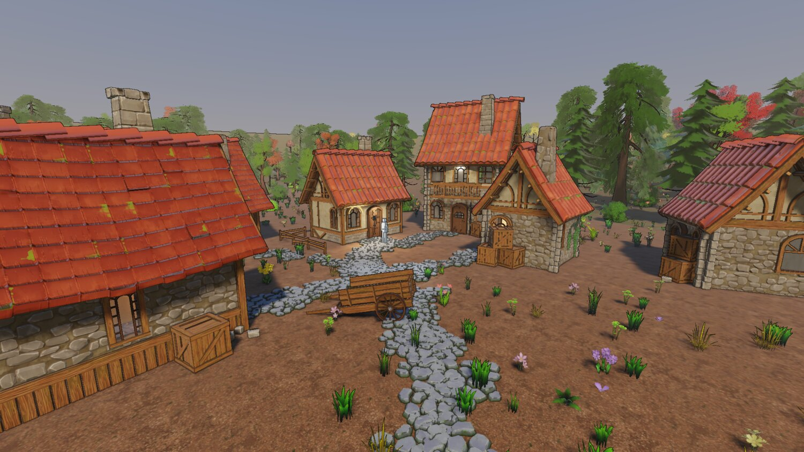
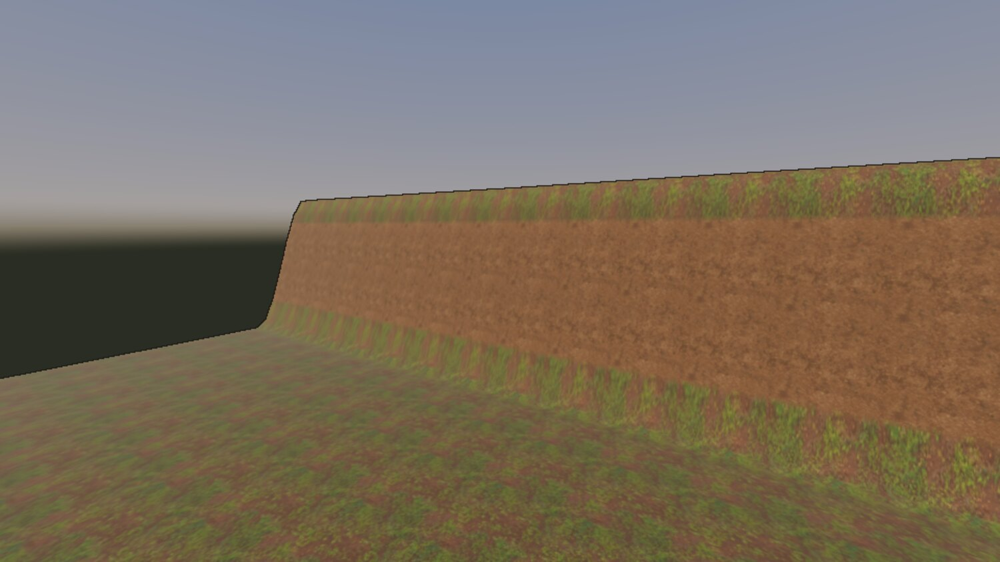
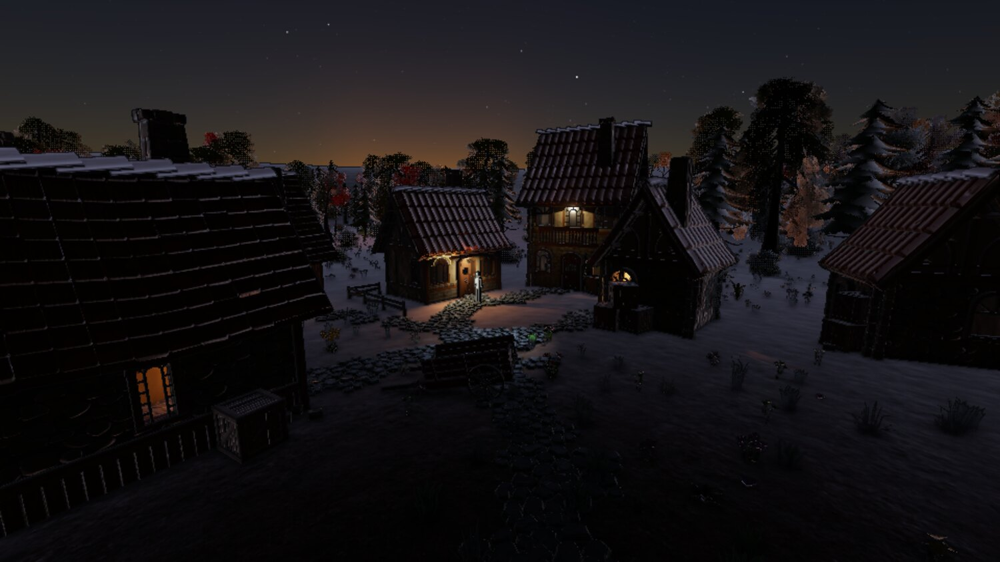
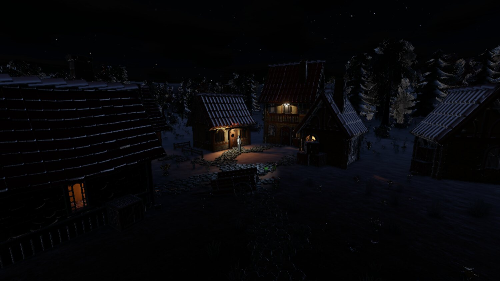
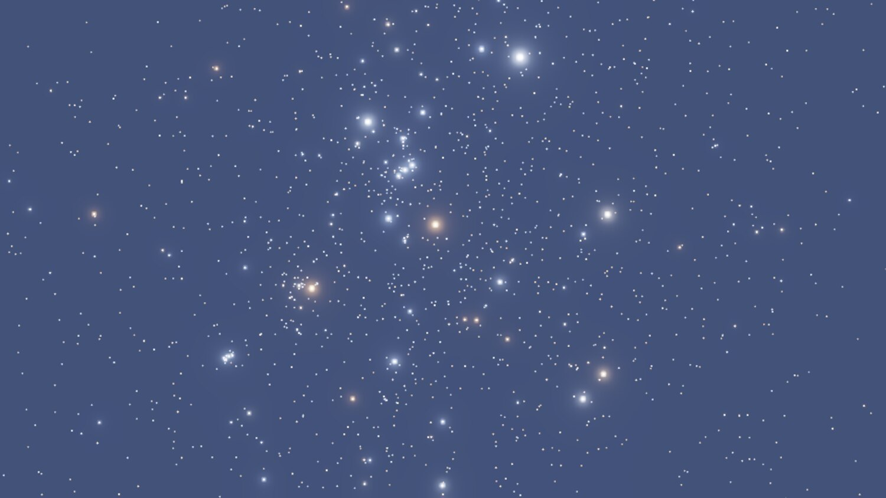
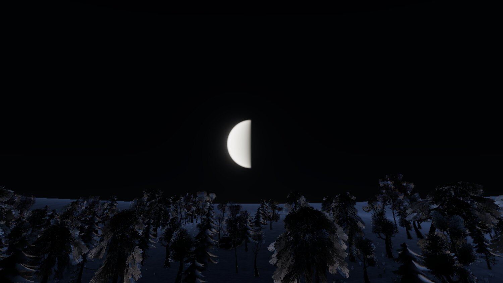

+++
description = "Terrain as a document instead of a mesh, a physical atmosphere driven by the scene's own clock, and a moon bug only a number could catch."
tags        = ["c++", "gamedev", "engine", "rendering", "terrain"]
+++

# gg, week 3: terrain, and a sky that knows what time it is

@tableofcontents

Two commits this week, and both of them are more "rethink" than "feature". The engine now has ground it
actually understands, and a sky that comes out of one physical model instead of four hand-tuned
approximations of one.

## The engine didn't know where the ground was

It knew about a mesh. `assets/demo/models/terrain.gltf` was baked from a sine function by a Python
script, loaded like any other model and collided like any other triangle mesh, so every consumer that
needed the ground had to find it the hard way. The collision bake walked 18k triangles into a
general-purpose BVH. The picker cast a ray. `drop-to-ground` cast a ray. Last week's drill decoded the
glTF off disk and reimplemented a heightfield sampler in Python, which is about where it stopped being
funny.

A heightfield answers "how high is the ground at (x, z)" with an array index and a bilinear filter. That
one property is most of why terrain is cheap for physics, placement, scatter, shading and streaming all
at once.

The other problem was that the old terrain was an artefact with no source; the real authoring was a
function inside a script that emitted a glTF. Terrain is a proper document now, and a hand sculpt is a
raster layer on top of the imported base, so re-exporting the base leaves the hand work standing.

_20 August. The same village, now standing on ground the engine understands._

I settled a few decisions before writing any of it, because all of them are miserable to retrofit:

- One cooked heightfield is the representation every consumer reads, so the picker, the ground probe,
    the collider and the shading can't disagree about where the ground is.
- Tiles from day one, even at one tile. A single-tile terrain is the degenerate case of a tiled one and
    a monolithic one is a rewrite. Jolt forces square power-of-two tiles anyway.
- A sculpt is a height delta in a layer above the base, because a stamp list replays at a cost that
    grows with the session, and a raster composites in fixed time.
- Scatter is cooked instance data, with no entities involved. 1293 of the demo scene's 1700 entities
    were vegetation. A thing with no uuid, no scene record and no undo blob is what makes a forest
    affordable to store and to edit. The cost is real, mind you: an instance can't carry a component,
    can't be selected, and can't be deleted on its own. Anything that needs addressing individually gets
    placed as an entity instead.

_Material layers placed by rule. Slope, height and curvature masks decide what goes where, and each
layer's colour map carries its own height in its alpha channel, so the layers blend on those heights.
Wood chip settles into the cracks of the mud underneath, and that's most of the difference between ground
and painted ground._

## Gotchas

`set-transform`, `drop-to-ground` and `set-parent` all wrote a placement and never told Jolt, so a body
stayed where its entity used to be until the next scene load. Every query a client can make reads the
scene index instead, so nothing noticed. Two representations of one thing, only one of them maintained,
and the maintained one happens to be the one every test reads. Classic.

Jolt's `SetHeights` quantises to whatever range the samples spanned at creation, and silently clamps
every later edit to it. Every sculpt upward would've stopped dead at the field's original maximum, with
the rendered ground carrying on above it. This one only got found because Jolt's documentation happens
to mention it, in the sentence next to the one you actually went there to read. A library that silently
clamps where it could refuse is a bug with no symptom, and I'd much rather it threw.

Terrain's fragment stage grew a third uniform block and its pipeline still declared two. Worked fine on
one driver, out-of-bounds sampler fetch on lavapipe. Two hand-written numbers that have to agree, with
nothing that knows both, is a driver disagreement waiting to happen, so pipeline creation reads the
SPIR-V module now and refuses a shader that reaches further than the pipeline declares.

`paint-scatter` reported `admits: 0.0` at every stroke that did nothing, and the viewport threw the whole
result away, so a brush that couldn't plant read as a broken tool. Only a person with a mouse was ever
going to find that one.

A rule with a minimum wants a falloff smaller than the gap to zero, or it has no minimum at all. A
`slope_min` of 1.6 degrees with a falloff of 2.4 admits dead-flat ground at a third weight, and the first
wood grew straight through the village clearing.

And one about measurement. A terrain stroke re-cooks the asset, and the cooker CLI said the cook took
88 ms. Driven over the socket against a running engine, with none of the CLI's fixed process cost in it,
it took 89 ms. Hmm. Splitting the cook took it to 35 ms, and the rest turned out not to be the cook at
all: a heights-only upload into the buffer already bound, cycled instead of synced, took the same stroke
to 16.7 ms. Two thirds of what looked like cook cost was a device sync, and nothing short of measuring
each arm on its own would have said so.

## The atmosphere

The scene had a gradient sky: three authored colours for the backdrop, a second hand-fitted function for
the ambient, an exponential for the fog, and an authored warm white for the sun. Which, if you squint,
is one quantity sampled four ways:

| What                           | Authored as                    | What it really is                                |
| ------------------------------ | ------------------------------ | ------------------------------------------------ |
| the three sky gradient colours | authored constants             | sky radiance along a view ray                    |
| the ambient                    | a second hand-fitted function  | the cosine-weighted hemisphere integral of that  |
| fog toward the horizon         | one exponential toward one hue | the same integral, truncated at the surface      |
| the sun's colour               | an authored warm white         | sun radiance times transmittance along the ray   |

Keep those four independent and a day cycle means hand-authoring four curves over twenty-four hours and
somehow keeping them consistent with each other. Derive them from one medium and you author two or three
physical parameters, and all four fall out right at every hour, including the ones that are hard to fake
by hand.

So the scene now authors an hour, a date and a place, and the sun position, sky, fog, ambient and
exposure all fall out of that. The model is Hillaire's, and it won on two counts that have nothing to do
with image quality: its aerial perspective volume is a froxel grid over the view frustum, which the
clustered lighting work had already built and debugged, and it's compute plus lookup tables, which is a
pipeline kind that same work had just introduced.

A sky is a mode, though, and I want to be careful about this one. The engine serves whatever game links
it, so a physical sky wired in as the only sky there is would be the engine holding an opinion about art
direction. `sky_mode` picks how the backdrop gets produced, and every mode answers the same four
questions, so a game wanting an authored sky never pays for scattering and a game wanting an abstract one
isn't fighting a physical model to get it.

_Dusk. The sky stays lit well past sunset because a ray leaving the camera clears the planet's shadow
above about 23 km, and the ozone layer sits at 25. Ozone takes green out of a beam that's crossed a whole
atmosphere, and that's what turns late twilight magenta._

Auto-exposure came with it, because it had to. A frame lit by lanterns and a moon is orders of magnitude
under noon, and no fixed exposure serves both. The metering is a GPU histogram, and over the demo village
it reads:

| Hour | Solar altitude | Metered exposure  |
| ---- | -------------- | ----------------- |
| 12.0 | 62 up          | 0.97              |
| 20.6 | 4 up           | 10.1              |
| 21.6 | 4 down         | 166               |
| 22.5 | 11 down        | 200, at its limit |

Noon coming out at 0.97 is what sold me on it. I'd hand-exposed the scene to 1.0 by eye, the meter
agrees to within three percent, so switching metering on moved nothing about the look I'd already tuned.

## Night

_The same village at night. There's one directional light, and the clock decides whose it is._

There's one directional light slot, and whichever body weighs more by luminance takes it. The sun
outweighs a full moon by about 400,000, so there's no hour at which the second one is worth an atlas
tile, and the handover falls where the sun's attenuation has already taken it to nothing.

The payoff is that the scattering tables follow the light, whichever body that is. At night the sky-view
table is built for the moon, so a moonlit sky is Rayleigh scattering with a source 400,000 times weaker,
and that's what keeps it blue at all. It cost exactly nothing: the uniform that said `sun_direction` says
`light_direction` now. Nice.

_8920 stars from the HYG catalogue, filtered to what an unaided eye reaches. Nothing about the colours is
authored: B-V through Ballesteros to a temperature, then Planck's law through the CIE observer into linear
sRGB._

_The moon has no albedo texture and no phase angle. The disc reconstructs the point on the near hemisphere
under each pixel and lights it from the sun's own direction, which gives the terminator, its orientation
and its curvature together._

Three things went wrong with the night, and all three were invisible in a different way.

Moonlight shadows had been drawn since the day the moon landed. Cascades followed it, atlas tiles got
allocated for it every night frame, and the shadow report said so. What nobody (me included) had checked
was whether the light doing the casting actually delivered anything, and against a night floor lifted
ten stops it was delivering a thousandth of the ambient. The frame didn't look broken. It looked like an
unshadowed night, which is what a night mostly looks like anyway. So the feature was finished, correct,
and completely pointless, and no test of it in isolation could have said so, because the question is
what its output is worth next to the thing it's competing with.

The moon's first shading built the normal along the direction to the moon instead of against it, so it
shaded the far hemisphere, and every phase drew as its complement. Nothing about that looks wrong. A 60%
moon drawn at 40% is a perfectly plausible moon. The thing that caught it was `get-time`, which reports
the illuminated fraction computed off the same two directions, and disagreed with the picture.

@inline_success **Pro-tip:** An image needs an oracle that isn't another image. A golden baseline will
happily bless a moon at the wrong phase forever.

And the demo scene's date had been picked for a full moon, and got one, along with midsummer as a bonus.
At 51.5 north in May the sun never gets more than 23 degrees below the horizon, so the sky sits in
astronomical twilight all night, and I'd been judging star brightness against a sky that was still lit.
The latitude belongs to the content and the date didn't, so the date moved to late September.

There was also a fairly silly one. Adding a moon component to the environment entity at half past nine
in the morning aimed the sun forty degrees below the horizon and took the scene straight to night, with
nothing in the log. Two bits of code had each independently grabbed the first transform they found, and
two first-found picks only agree by luck. Lesson there: a component that's inert on its own is one the
editor will happily let you put anywhere, so whatever the engine needs from its placement, the engine
has to enforce.

## Where it stands

|                    | source | tests  | docs   | shaders |
| ------------------ | ------ | ------ | ------ | ------- |
| 17 Aug, phase 6.5  | 54,725 | 19,066 | 22,567 | 2,365   |
| 20 Aug, terrain    | 66,856 | 23,278 | 23,313 | 3,225   |
| 23 Aug, time of day| 82,202 | 26,117 | 25,211 | 5,333   |

_Line counts._

So: terrain you can sculpt, paint and plant in the editor, with the result under the renderer and the
physics world in the same frame as the stroke. A sky, a sun, a moon, stars and an exposure that follows
all of them, driven by a clock the scene owns.

One thing I haven't worked out is what lies beyond the edge of a terrain asset. The demo basin gets
around it with a rim, and a rim is content, and fog dense enough to hide the edge fights the density I'd
already settled on. No answer yet. Might not need one for a while.

The clouds are still a flat slab, and one of my four complaints about the frame at the end of this week
was that they looked like an N64 skybox. That's next week, along with discovering that a rim light I'd
tuned against the old sky was 85% of a moonlit image.

## Credits

Everything in these shots that isn't engine is bought or borrowed:

- The buildings, props, trees, foliage and rocks are [Quaternius](https://quaternius.com/) kits: the
    Medieval Village and Stylized Nature MegaKits, bought as the paid source versions, plus the free
    Ultimate Stylized Nature set. All of it is released CC0, and he takes Patreon support.

- The ground materials are [Poly Haven](https://polyhaven.com/) textures, CC0.
