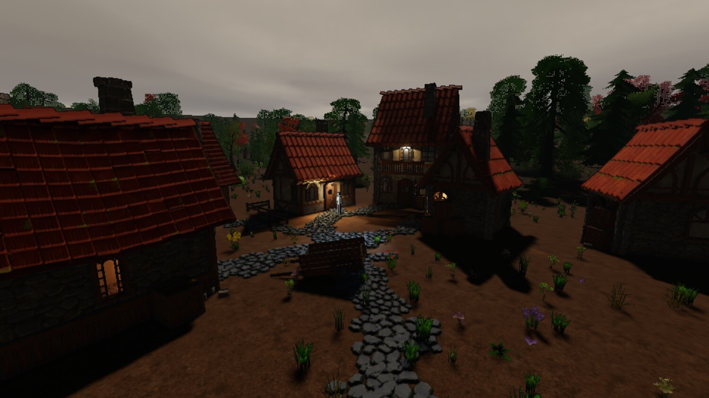
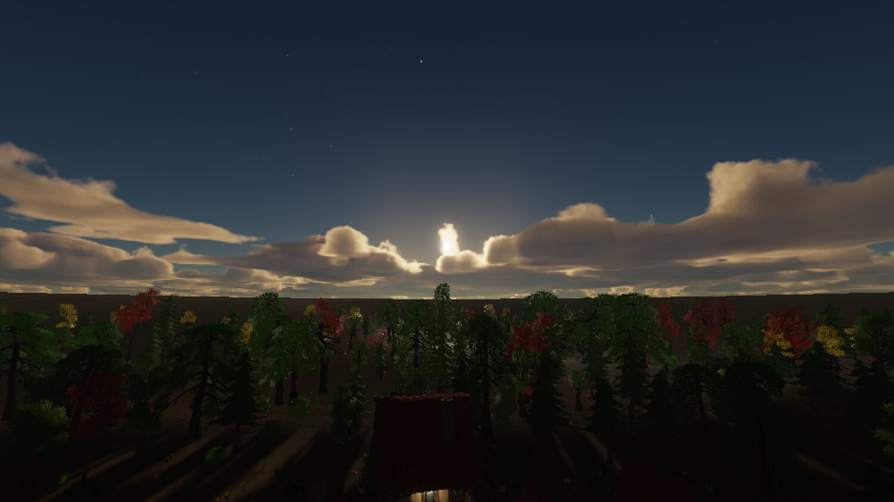
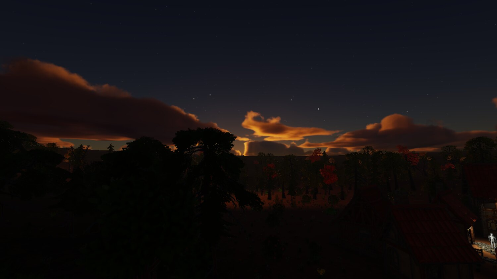
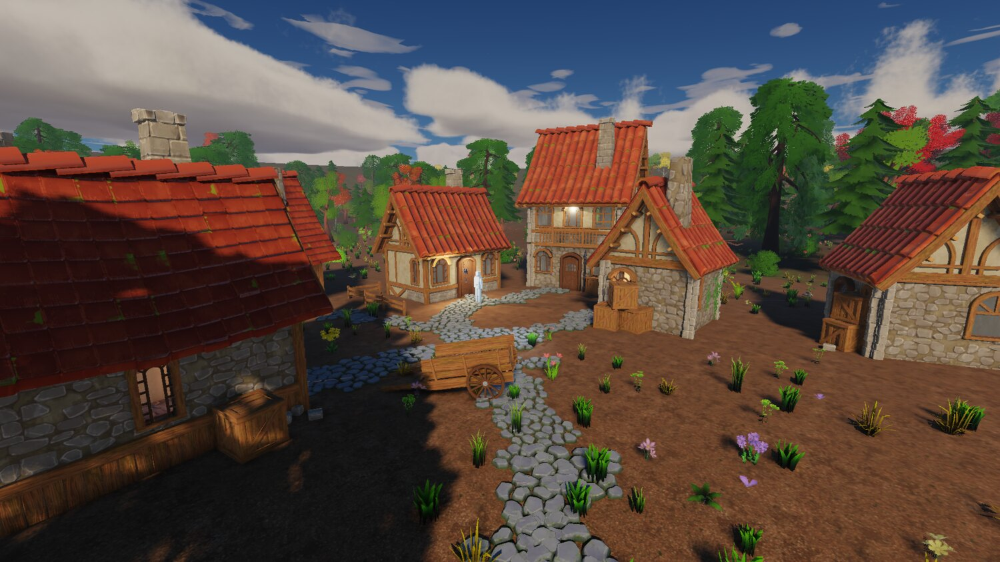
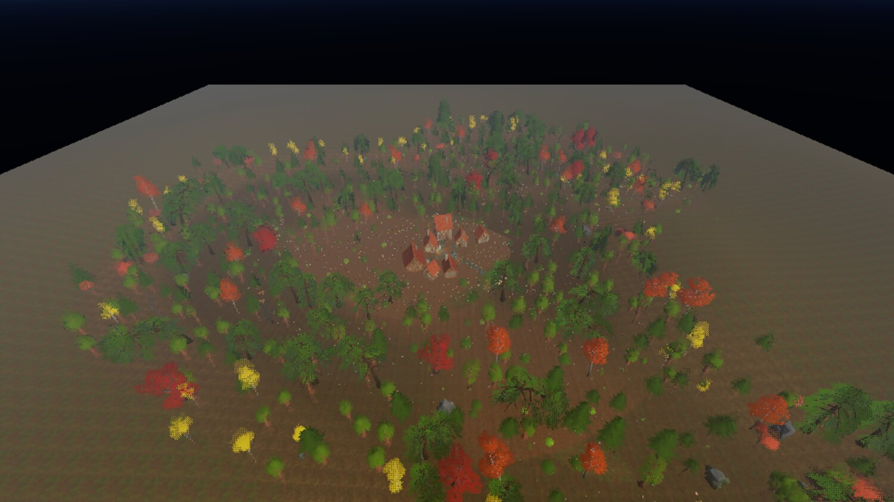

+++
description = "A rim light that turned out to be most of a moonlit frame, proper clouds, deleting the art direction, and a frame that cost 12.9 ms drawing nothing."
tags        = ["c++", "gamedev", "engine", "rendering", "performance"]
+++

# gg, week 4: clouds, scale, and taking the look back out

@tableofcontents

Last week ended with a physical sky and four complaints about the frame: a moonlit forest that read as
shiny ghosts, ground in shade reading blue and wet, a forest floor with no shade in it at all, and clouds
like an N64 skybox.

Most of that had one root cause, and it's the sort of thing that only shows up when you change the scale
of something underneath a value you tuned by eye.

## The rim light

The renderer had a rim light term, normalised to unit luminance on purpose so it wouldn't fade at dusk.
Against the old gradient sky, with its static, bright, artist-owned ambient, that was a fairly defensible
thing to do.

Against a derived sky whose ambient spans four orders of magnitude, it made the rim **85% of a moonlit
frame**. 85%! And 14% of a daylit one. Normalising by luminance instead of by the largest channel had
also given the tint a blue of 2.06, so the rim was also the whole of the blue in the shade.

Making the additive terms proportional took shaded ground's blue-over-red from 2.82 to 1.12, which is the
old gradient sky's own figure, and lit-to-shade contrast from 27 to 79.

The tempting fix was to just put the gradient sky back. Reconstructing it faithfully is what killed that
idea: in gradient mode the rim and the ambient specular were already 78% of the light in shade, against
89% now. The decoration hadn't changed at all; the thing it was being measured against had.

Also from that batch: the two occlusion terms answer at two different scales and neither substitutes for
the other. The screen-space search reaches three quarters of a metre, and is capped tighter than that
past three metres of depth, so a twenty-metre canopy is invisible to it at any radius. Turning
`occlusion_radius` up was the obvious move and did nothing, because a knob whose reach is clamped by
something else just looks ineffective, and nothing anywhere said so.

Then a wrong estimator that failed with the wrong sign, which is what gave it away. Averaging
independent disk taps for a horizon made the ground under a canopy come out _lighter_ the further the
taps looked, because far taps see open sky. A term that gets weaker when it should get stronger isn't
mistuned, it's wrong, and no amount of fiddling with the constants will save it.

And the usual one: instruments first. This batch paid for skipping that. There was no debug view of the
ambient or any of its terms, so the one quantity behind three of the four complaints had to be
reverse-engineered by regressing against captured PNGs, which is a stupid way to find anything. There's
an `ambient` view now, an `ambient_terms` view, and a `sky_visibility` one beside them.

## Clouds

The flat cloud slab became a marched spherical shell shaped by a weather map, traced at reduced
resolution against a history private to its own pass, casting a Beer shadow map on the ground, shafting
light through the aerial perspective volume, with a cirrus sheet above it.

_Overcast, shafts and sunset. Per-sample transmittance at each sample's own altitude is pretty much the
whole of a sunset, and all of it is shader work._

I did them in the order composition, light, affordability, couplings. Composition first, because one
tiled noise feature under a single global coverage scalar doesn't compose anything. Light second, because
it's shader-only and buys the most realism per line of code. The sub-resolution trace third, since it's
what makes every cost after it small. And ground shadow before shafts, because a cloud deck that doesn't
dim the ground under it reads as broken from anywhere.

Two bugs on the way, neither visible from the outside.

The cloud light march never advanced its origin, so three growing steps all landed inside the first sixth
of the path, and it read about 2.5x the optical depth a fine march gives. The sky cooked, the march ran,
and the only symptom was clouds slightly too dark between their lit rims.

And the actual cause of the "N64 skybox" complaint was duller still: the scene was authoring a
sixteen-kilometre base feature. That's one cloud across the entire visible sky. Whoops.

## Taking the art direction back out

The renderer had an art direction baked into it: an outline pass, a crease detector, an object-boundary
term, a banded diffuse response, and a banded cloud tint sharing the same function.

All of it's gone now. The argument against it had been sitting in my own plan document since day one, I
just hadn't applied it here: the engine may serve more than one game, so the look belongs to the game.
Phase 6 built one art direction into the renderer anyway, and it had reached further than I'd realised,
from a hand-written import sidecar key, through a field of the cooked model format and a std140 uniform
slot, into a channel of a scene attachment and the width of that attachment. Changing the art direction
later would've been surgery.

Measuring it first is what settled it. Four arms photographed in one engine session over the socket: the
ink moved 8.5% of a village frame, the bands and rim 37.3%, both together 42.6%, and the frame with
neither still read as a coherent stylised scene, because the fetched packs carry the style in their own
art.

Fair caveat: the demo village is somebody else's stylised content, which flatters a renderer with no look
of its own. A flat greybox would probably answer differently.

_The same village with the ink and the bands deleted. What's left is a wrap term and a rim._

Everything came out properly, as opposed to being defaulted to off. A knob at zero isn't a removal: a
switched-off term is still the art direction deciding the frame's shape, and it's still costing an
attachment, a uniform slot and a field of a cooked format.

What survived is the attachment set. Linear depth, the object id, the ambient share: all general-purpose,
and each has a consumer that isn't a look. Only the ink weight and the packed geometric normal died. The
line I ended up drawing is that the renderer publishing data is fine and the renderer holding an opinion
about it isn't.

One bug from the deletion. Removing a slot out of a `uint4` renumbered the ones after it, and of the two
sites filling that block, one was still patching by the old index. Every cloud trace then read its debug
view as its sky mode and took the non-atmosphere branch, which drops the transmittance table off the sun,
the harmonic ambient off the underside and the aerial perspective off the deck, all at once. A sunset's
clouds came out neutral and more than twice as bright. Both layout guards passed, because both sides
agreed about where the four words sat and neither had an opinion about which word meant what.

@inline_attention **A batch that re-records its own golden baselines can't also be guarded by them.**
Thirty baselines got re-recorded in that batch because the change moved every lit surface, and eighteen
of them enshrined the bug above as correct on the way past. The suite was green and the defect was in
the baselines. What found it was looking at a frame the change had no business touching: the clear sky
either side of the bad one was byte-identical, which said the cloud pass alone had moved. Use your eyes,
per the week one pro-tip.

## What a second game asks for

Taking the look out raised a bigger question. The engine holds no art direction now, but it still holds
a pile of assumptions about the kind of content it's going to be handed.

The next survey was against two frames the demo village can't pose: tens of thousands of things, and a
photoreal look. The finding that reordered everything was that every performance number on file had been
taken in a regime where the renderer is fragment-bound and the CPU is free, and both of those stop being
true well before that scale. Measured offscreen with fifty thousand extra instances, the frame cost
20.0 ms at 160x90 and 20.8 ms at 1080p, so it didn't care about pixels at all. Aiming the camera at empty
sky in the same scene, with zero items drawn, zero draws and zero triangles, it still cost 12.9 ms over
53155 resident entities.

The per-frame cost was O(resident), and nothing in the frame was threaded. Oops.

Both halves got fixed. The renderer now takes a change set and patches the candidate and caster boxes it
already holds, so a settled frame pays only for what moved. The frustum cull and the item gather fan out
on a job system over enkiTS, with the worker count stated in config and never read off the hardware,
because the replay tool rests on determinism and "however many cores this box has" isn't deterministic.

| frame                                     | before  | after   |
| ----------------------------------------- | ------- | ------- |
| 160x90, everything visible                | 20.8 ms | 8.9 ms  |
| 160x90, the same fenced                   | 31.4 ms | 15.3 ms |
| 1080p, camera at empty sky                | 5.5 ms  | 1.8 ms  |
| 1080p, the village at eye level           | 1.91 ms | 1.72 ms |

_The village plus fifty thousand stress instances, offscreen on a 3070, four workers._

Threads bought less than the arithmetic did, and the split says why. Against the serial arm of the same
build, the item gather went from 4.16 ms to 1.01, which is most of four workers' worth. The tree query
went 3.69 to 2.69, which is barely one and a half. Eight workers took it to 2.26 and sixteen took it
nowhere, so it isn't starved for threads: a frustum walk is three dependent random loads per leaf, and
threads don't multiply a memory latency.

Also: two threads' `push_back` calls landing in one cache line cost 0.19 ms of the gather on their own.
False sharing, the classic. Written down so nobody rediscovers it.

The other half of the survey is the part I keep coming back to. An assumption about content is the same
kind of defect as an opinion about look, and it's much harder to see, because nobody can point at it in
a screenshot. The four this engine still carries: MSAA as the only antialiasing, which assumes geometric
edges dominate; a texture cook that reads 8-bit PNG and writes BC7 and BC5, which assumes there's no high
dynamic range data anywhere; a material model of one UV set and one glTF extension, which assumes the
asset tier the fetched packs happen to be; and a single-valued heightfield, which assumes no caves.

Each of those is probably fine for the first game and a wall for some other one. I don't know yet which
wall the second game hits first, and I'm not going to guess.

## Distant trees, and a resolution that drives itself

_The impostors debug view. A model with a cutout material and enough triangles gets a grid of views baked
at cook time, and a distant instance draws as one quad._

The impostor bake stores albedo with coverage in alpha, plus a model-space normal, and no lighting at all,
so a distant tree is lit at runtime and still turns with the sun. The tile's shorter side is derived from
the model's own proportions, so a birch doesn't spend two thirds of every tile on air.

The other scaling item came from me misreading a symptom. A quality tier states MSAA and a render scale
as absolute numbers, so it says nothing about resolution, and the same tier is a different amount of work
on every display. On a 3758x2074 window the `high` tier cost 16.0 ms against a 16.67 ms interval, with
three of nine sampled camera poses over it outright. A frame that misses vsync waits for the next
refresh, so what you see isn't 60 fps sagging to 58, it's 60 alternating with 30 and averaging 45. I
read that as "the engine is slow". It wasn't. The tier was mis-scaled for the display.

There's a resolution scaler now. Every decision in it is about it not becoming a second opinion about the
look: it only ever scales up to the ceiling the tier already stated, it drops on the first frame over
budget and climbs back a hundredth at a time after twenty frames under, it ignores a frame past four
times the interval until it's seen four of them in a row, and it's windowed sessions only, so an
offscreen frame with a golden image waiting on it is never touched.

## A fork of SDL, and packs of art

Two non-rendering things landed this week too.

The engine now builds against my own fork of SDL, and the fork is mandatory: there's no configuration in
which it builds against stock. It carries GPU timestamp queries, done against the API shape the
maintainers themselves blessed in an earlier issue, and read-only device properties naming the native
objects the backend was built on, so the engine can report the device's own heap and budget as well as
what it asked for.

Native handle exposure has been refused upstream on the record, by three maintainers across three issues,
so that one isn't going anywhere. Fine. Where upstream's appetite lies tells you where a patch can go and
nothing at all about whether the renderer needs the capability. What actually bounds how many patches
I'm willing to carry is the rebase: three of the files a GPU patch touches are list tails, so every SDL
bump conflicts there whether the branch carries one patch or four.

And bulk art moved out of git entirely. A pack is a zip attached to a GitHub release, pinned by SHA256 in
a recipe beside the dependency pins, fetched at configure time into a gitignored directory. Size wasn't
really what decided it. What did: a gitignored directory needs no incantation at clone time, and there's
no way to commit a mistake into it that only a history rewrite can cure. Git couldn't give me either of
those at any price.

The pack ships its own identity index inside the zip, because identity is minted, and an index written
on arrival would differ on every machine.

Each pack also ships a written guide, and the guide is the interesting bit, because it records the stuff
no query can answer: the grid the modules sit on, whether an origin is at the foot of a thing or buried
under it, which names lie about their colour or their facing, and what the set doesn't contain. The
village kit shares one origin across every ground-level piece, and its walls have a different material
on each face. Neither of those is derivable from a bounding box, and both will waste an hour of
anybody's time exactly once.

## Where it stands

|                      | source | tests  | docs   | shaders |
| -------------------- | ------ | ------ | ------ | ------- |
| 23 Aug, time of day  | 82,202 | 26,117 | 25,211 | 5,333   |
| 26 Aug, fixes        | 84,078 | 35,204 | 25,431 | 5,485   |
| 26 Aug, clouds       | 87,638 | 36,256 | 26,129 | 6,987   |
| 27 Aug, scalability  | 90,975 | 37,188 | 27,966 | 7,640   |
| 30 Aug, perf and gpu | 94,560 | 38,483 | 28,939 | 8,383   |

_Line counts._

Four weeks in and the renderer is finished enough to leave alone for a while. What it doesn't have is a
game attached to it, and the two subsystems a player notices before any of the rendering are the two
it's never had: it makes no sound at all, and it can't draw a menu. So that's next.

## Credits

Everything in these shots that isn't engine is bought or borrowed:

- The buildings, props, trees, foliage and rocks are [Quaternius](https://quaternius.com/) kits: the
    Medieval Village and Stylized Nature MegaKits, bought as the paid source versions, plus the free
    Ultimate Stylized Nature set. All of it is released CC0, and he takes Patreon support.

- The ground materials are [Poly Haven](https://polyhaven.com/) textures, CC0.
