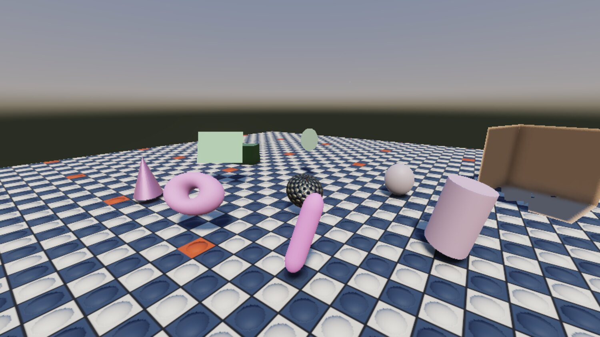
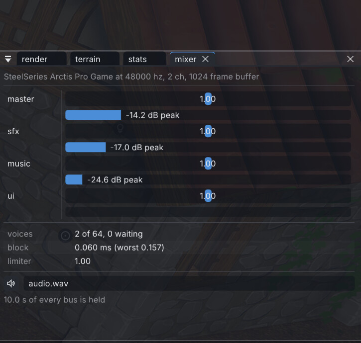
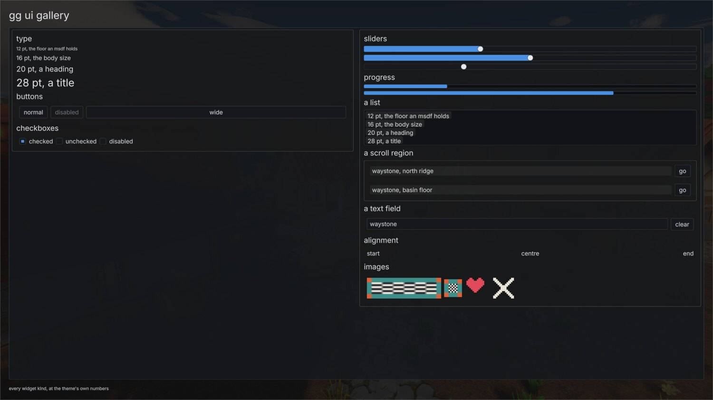
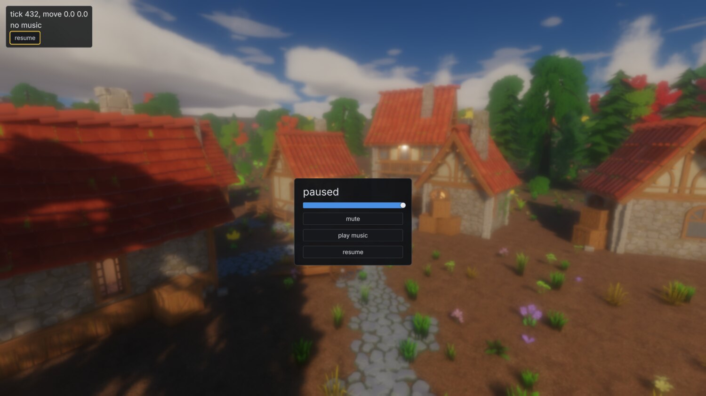
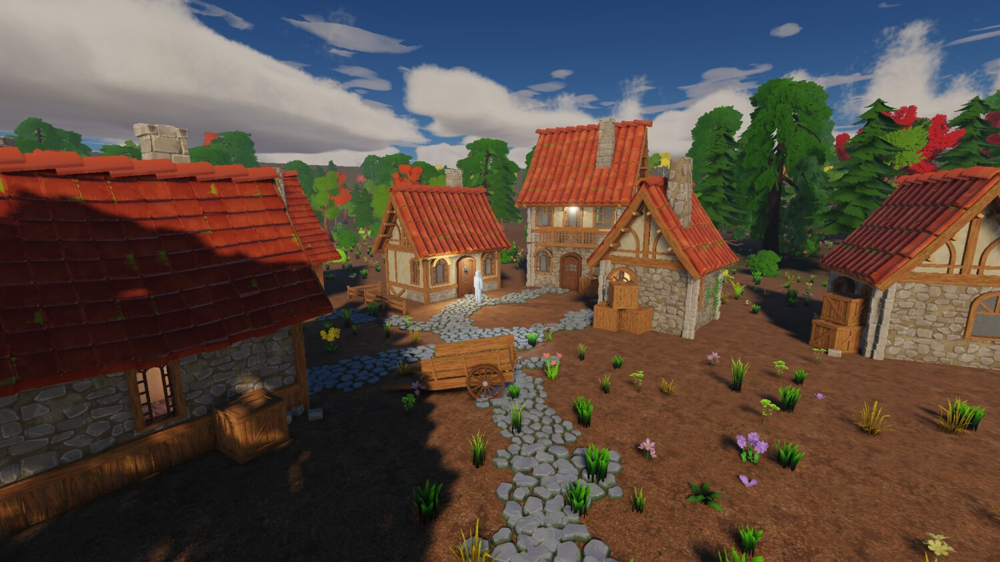

+++
description = "An engine that makes noise and draws a menu, a mixer that never touches the frame loop, and what a month of this actually produced."
tags        = ["c++", "gamedev", "engine", "audio", "ui"]
+++

# gg, week 5: shapes, sound and a UI

@tableofcontents

Four weeks in, the renderer is finished enough to leave alone for a bit. This week was the two
subsystems a player notices before any of that stuff: the engine made no sound at all, and it couldn't
draw a menu.

Both are in now, along with two smaller things that had to land first.

## Shapes with nothing behind them

A box, a sheet, a disc, a UV sphere, an ico sphere, a cylinder, a cone, a torus and a capsule, all built
in-process from a handful of numbers on the entity.

No source file, no identity index entry, no cooked output, nothing in the cooker. The scene stores the
recipe, so the file says "a torus with a tube ratio of 0.3 and 24 segments" and never a hash of one.
Every shape is unit-sized, so the entity's transform is the size.

_All of it collides, picks, undoes and saves like anything else, because a primitive is a component and
the registration layer does the rest._

They exist because blocking out a level with imported meshes is silly, and because the first playable is
going to be a greybox. The one wrinkle was identity: a generated shape has no file to mint a uuid
against, so it derives one from the parameters that built it, as a version 5 uuid so it can't collide
with the minted (version 4) ones. It's really a sharing key more than an identity; two entities asking
for the same torus get the same mesh.

## More than one game

`source/games/<name>` holds one game each: sources, a CMakeLists, and a content declaration. `GG_GAME`
picks which one a build compiles and which declaration gets staged into the cooked tree.

That declaration answers a question the asset pipeline couldn't answer before, which is what ships.
Everything cooks, so the editor can browse and place all of it, but only what a game actually reaches
should go in the pack, and that's a property of the game, so it lives beside the module that decides it:
a list of root scenes to walk transitively, plus named globs for anything the game looks up by name that
no scene references.

Fonts are the worked example, since a font is a closure leaf: no scene references one, so the walk never
reaches it, and you'd ship a pack full of text with no face to draw it in.

Over-stripping is the failure mode nothing else can see. A dangling reference is loud, while an asset
that was needed and never reached is silent until a player finds it. So the pack writer classifies every
cooked file into exactly one bucket and prints the result by folder, and there's a test that loads each
root scene headless with nothing mounted but the pack.

## Audio, from nothing

There was literally none. No dependency, no decoder, and `SDL_Init` wasn't even asking for the audio
subsystem.

SDL owns the device: it opens the default one, follows it when it changes, converts to whatever it wants,
and runs the thread that asks for more. Everything above that is engine code, because the event, bus,
snapshot and scheduling layer was going to be mine whichever library sat underneath.

The mix runs on SDL's device thread and touches no engine state at all. The frame thread posts fixed-size
POD commands through a single-producer single-consumer ring, the mixer answers through a second ring and a
status mailbox, and nothing on the device thread allocates, locks, logs or reads a file: the voice pool,
the bus buffers and the limiter's delay line are all sized in the constructor.

The reason for all that ceremony is a number from week two. The frame loop parked for seconds behind an
obscured window (17.7 and 23.3 measured), and a frame costs whatever the GPU decides it costs. Audio
riding the frame loop would drop out on every hitch and stop entirely when the window was covered, which
is not a thing I'm willing to ship.

The status is a mailbox instead of a third ring because a ring can refuse a push, and a frame thread that
parks stops draining, so the message a full ring would drop is precisely the newest one. That way a
dropped event costs promptness and never correctness: the frame side reconciles against the status, a
leaked voice slot heals itself, and a replaced wave's old bytes get freed once no slot names them.

_The mixer panel. Buses, peaks, how many voices are sounding, and how long the last block took._

A voice costs about 3 microseconds at unity pitch and about 25 pitched, measured interleaved in one
process with the first pass thrown away. Unity is the exact-copy path and anything else runs a
Kaiser-windowed sinc interpolator, and that's the whole difference. A full pool of 64 is 0.21 ms of a
block at unity and 1.63 ms pitched, which is where 64 comes from as the pool default.

Above the mixer there are three layers, each of which exists because otherwise the one below it would
end up being authored in C++.

A wave is a recording. It cooks to 48 kHz interleaved PCM16 with integrated loudness and true peak
measured per ITU-R BS.1770-4 and written into the file, normalising nothing.

A sound document is a hand-written TOML file naming one or more waves and the rules over them: random or
sequential selection, gain and pitch ranges drawn per play, a bus, polyphony, a cooldown, a priority for
when the pool is full, and a loudness target each wave gets levelled to, so a set gathered from four
sources at four levels plays at one. A random set never picks the one it just played, which is the entire
point of authoring four footsteps instead of one.

A placement table inside that document says how the sound behaves once it's somewhere: the attenuation
law, the distances, an emitter radius that collapses the pan when you stand inside it, a cone, a doppler
amount, and what a blocked path does to it. An `audio_source` component then plays it from wherever its
entity stands.

One thing I haven't decided is what a footstep should key off. A contact already names the terrain layer
it's standing on, and the sfx pack files its footsteps by surface, but the two sets don't line up one to
one: mud and wood chip map straight across, forest floor and leaf litter have nothing. So the layer name
is probably the right key, the mapping from it isn't the identity, and I don't know yet where that
mapping should live. On the layer, or beside it. Later.

Music is streamed. A wave marked as a stream cooks to Opus packets in a table instead of PCM: the demo's
music is 1,536,044 bytes raw and 98,541 cooked at 96 kbit/s in 401 packets, read from the mount by range
as it plays and decoded on the device thread. Crossfades are equal-power, at -3 dB per ear through the
centre.

And what a bus gives way to is the game's decision, so that's a file too: per-bus gain and low-pass,
duck envelopes, and named snapshots with a ramp time. The demo's music ducks under sfx by half, and its
pause menu moves the whole mix into a `menu` snapshot over 0.4 seconds.

## A user interface

The flat UI layer is one call a frame. A game describes its whole interface as a flat array of nodes and
gets one result per node back. The engine solves the layout, animates it, batches it and draws it in one
pipeline after the tonemap.

_Nine widget kinds, a theme, and the type ladder they draw with._

Text is cooked. A font goes to one atlas of multi-channel signed distance fields, with every metric in
ems, so one cooked font serves every size on screen. Kerning is read out of GPOS by shaping each pair,
which is where a modern face typically keeps it: Inter carries no legacy `kern` table at all, so the
path FreeType takes finds nothing in it.

The cook prints the one number that matters, which is the size below which the type goes soft. Eight
texels of distance range over a 48-texel em holds two screen pixels of range down to 12-pixel text, which
is about where MSDF stops reading well anyway.

A distance field is the one cooked thing whose defects are all invisible in its own numbers. A flip, a
transpose, a range too narrow for the smallest type, a neighbour bleeding into a glyph: each one is a
perfectly plausible field, and each one is obvious the moment you look at a specimen sheet. So the cook
writes one, and I look at it.

_The demo's pause menu. The blur is the frame walked into the existing bloom chain with its prefilter
open and the levels normalised, so the cost was one knob._

The theme is a file beside the game's content declaration, because a look is the game's. Colours, a
font-size ladder, paddings, radii and transition times, every key optional, re-read on save, and applied
whole or not at all, so a document that won't parse leaves the interface somebody is looking at
standing.

The same batch put the tick's input struct across the C ABI waist, so a game module now receives the
inputs its tick was fed, and the demo walks a character with them. That's the first bit of phase 8
arriving early.

## Taking stock

Five weeks. 24 commits.

|                   | source  | tests  | docs   | shaders |
| ----------------- | ------- | ------ | ------ | ------- |
| 4 Aug, phase 0    | 4,584   | 34     | 241    | 0       |
| 9 Aug, phase 3    | 18,703  | 5,673  | 14,548 | 343     |
| 17 Aug, phase 6.5 | 54,725  | 19,066 | 22,567 | 2,365   |
| 23 Aug, terrain and sky | 82,202 | 26,117 | 25,211 | 5,333 |
| 30 Aug, perf      | 94,560  | 38,483 | 28,939 | 8,383   |
| 4 Sep, audio and ui | 117,318 | 49,508 | 31,603 | 8,708 |

_Lines of C++, of tests, of markdown, and of Slang._

Also: 1175 test cases, 41 committed golden images, 144 socket verbs, and 29 hand-written dependency
recipes.

_Where it ended up. This is the same golden test case as week one's checkerboard room, four weeks on._

What's in there: a fixed-timestep loop with hot reload of game code, shaders and assets; a cooked asset
pipeline with minted identity and a mount stack; an in-engine editor with auditable undo and a command
socket; Jolt physics over sculptable terrain; a clustered forward renderer with shadows, MSAA, area
lights, reflection probes, LODs, impostors and a physically lit sky driven by the scene's clock; a mixer
with resident and streamed sound, spatialisation and a declared mix graph; and a flat UI layer with cooked
type.

What isn't: the game. The C ABI waist is still thin, the editor can't author a camera or a spline or a
prefab, there's no streaming, and nothing is said about a second region because there's only one.

If I had to pick two things to tell anyone starting something like this:

@inline_success **Build the iteration loop first.** Weeks one and two were mostly infrastructure with
nothing to photograph, and every week after them was faster for it. The two decisions that paid off the
most were fixed timestep plus an offscreen synthetic-time mode, which is what made committed golden
images possible at all, and the command socket, which turned "can I test this?" from an afternoon's work
into a script.

@inline_success **Instruments before features, every time.** Nearly every entry in these five posts
that reads as a debugging story is really a story about a missing instrument. The occluded-window hang
needed a diagnostic that named which GPU call blocked. The overdraw finding needed the overdraw view
before the sort it was meant to judge. The moon's phase needed a verb reporting an illuminated fraction,
because an image can't be its own oracle. The engine has 59 debug views now, and every one of them exists
because something was invisible once.

Next is phase 7 and phase 8: springs and animation blending, and then an actual traversal slice, with a
greybox forest edge, four waystones and a glide. Which means the next of these posts might finally be
about a game.

## Credits

Everything in these shots that isn't engine is bought or borrowed:

- The buildings, props, trees, foliage and rocks are [Quaternius](https://quaternius.com/) kits: the
    Medieval Village and Stylized Nature MegaKits, bought as the paid source versions, plus the free
    Ultimate Stylized Nature set. All of it is released CC0, and he takes Patreon support.

- The ground materials are [Poly Haven](https://polyhaven.com/) textures, CC0.

- The sound effects are Imphenzia's
    [Universal Sound FX](https://www.imphenzia.com/universal-sound-fx), under a purchased licence. That
    licence covers the sounds inside a game and not passing them on as sounds, which is why the pack I
    build from them is private.

- The type is [Inter](https://rsms.me/inter/) by Rasmus Andersson, under the SIL Open Font License.
