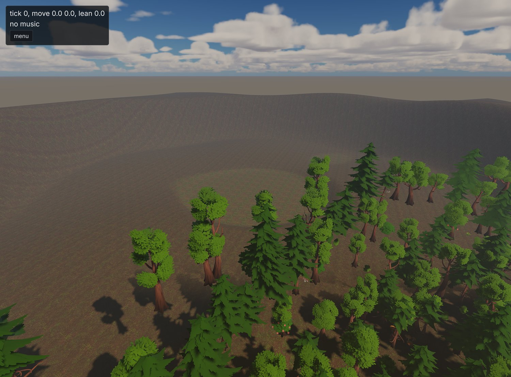
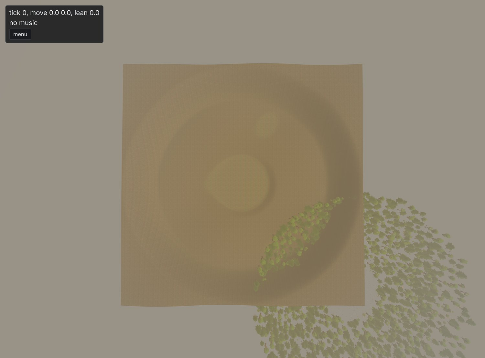
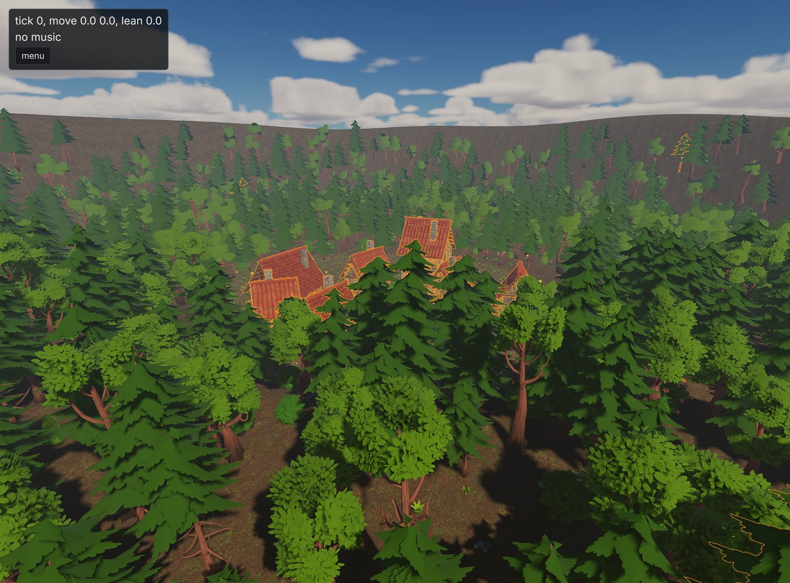
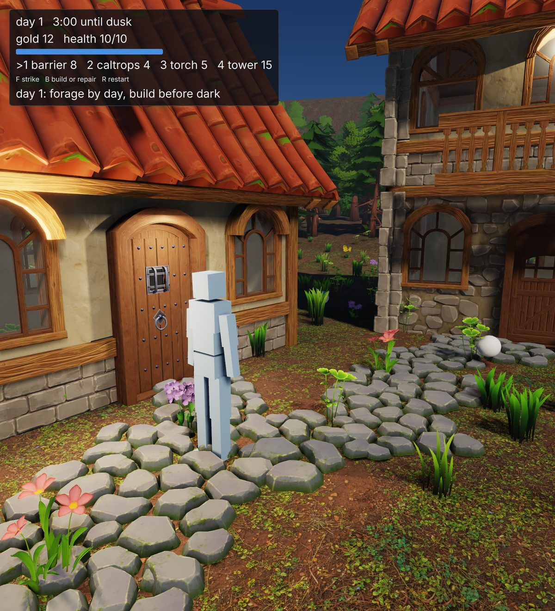
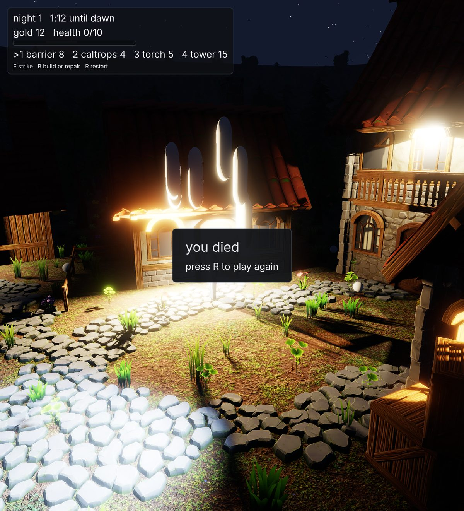
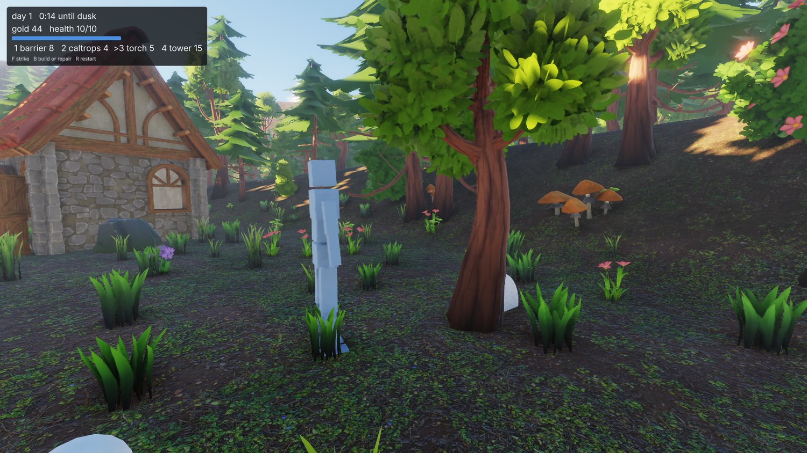
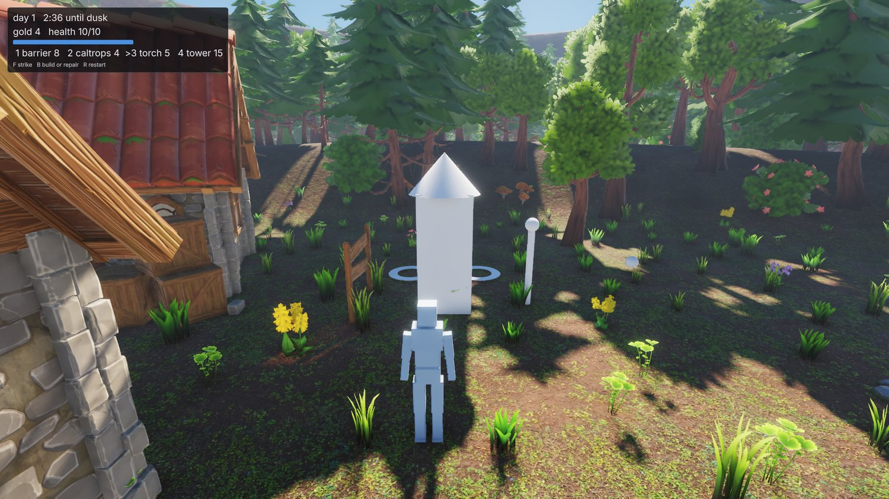
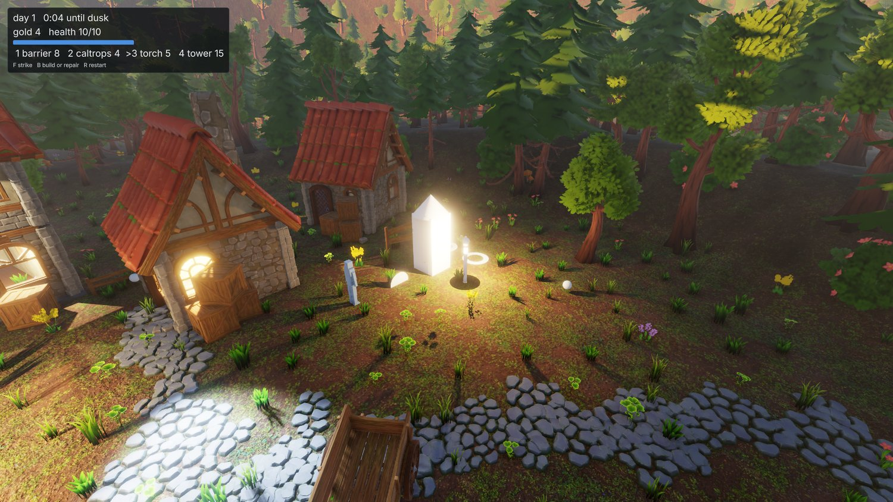
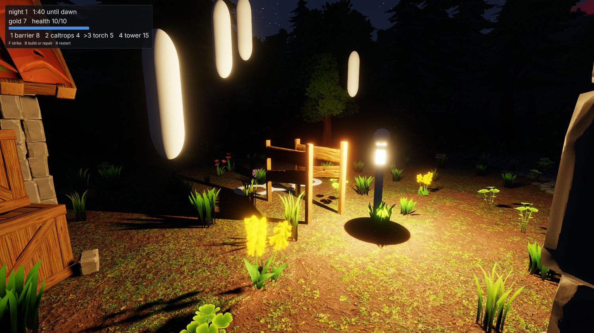
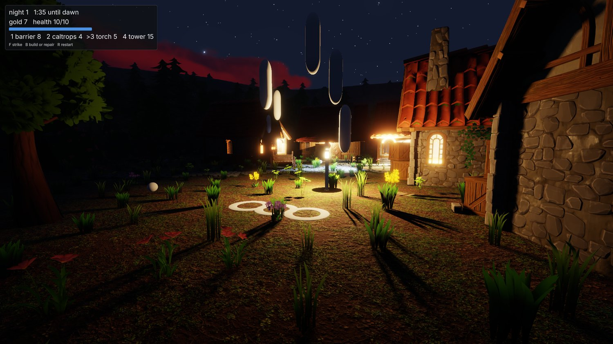

+++
description = "The first attempt at a game jam using the engine, and what fell out of it."
tags        = ["c++", "gamedev", "engine", "claude", "jam"]
+++

# gg, jam 1: undercooked

@tableofcontents

The plan has said since day one that engine work gets pulled by the needs of a game but I'm nowhere near
ready to work on a proper game I want to keep. The solution to this is a 'game jam'; a throwaway,
rapidly-built game, that hits features in the order a game needs them and has no patience for a feature
that's nearly there.

So here we are. On Sunday evening I ran the first game jam using the engine. ...sort of.

@inline_note **TL;DR**: the jam lasted exactly one question. The engine got the feature it was missing,
a game got built on top of it in 24 minutes of recording, and that was exactly enough to see just how
much was still broken.

@youtube{-yNSSXtdmmM,gg jam 1}

_The recorded part. The engine work that came before it isn't in there, because watching a progress bar
isn't much of a show. Cut to **2:40** if you want to see me playing the final 'game' (such as it is)._

## The brief

The setup was what week five built: `new_game.py` scaffolded a fresh game beside the demo, the
engine was up with the editor visible and an empty scene, and Claude had the socket and the source tree.
The prompt, trimmed:

> For our first ever jam, let's try to build a simple wave survival/builder. I imagine the core loop
> will go something like this:
>
> - a small village in a clearing amongst a thick forest
> - during daylight hours the player can forage for materials (break rocks, chop trees, collect debris
>   off the ground), and use those to build defenses
> - at night, things emerge from the forest to attack the player and destroy structures, at which point
>   the focus becomes visibility, defense, and survival
> - once morning comes again the focus is on repair, then back to shoring up defenses
> - each night is harder than the last
>
> For a jam we don't need progression or respawning - you die, game over, try again. Enemies can just
> be simple placeholders to start with (capsules etc). Let's have the player win if they survive 5
> waves (i.e. make it until morning 6).
>
> Drill me with additional questions on the game loop if there are any open, before you build.
> Ideally I won't have to steer you at all once we kick off.
>
> As well as being a jam, this is also a test of the engine, editor, and socket protocol, so as usual
> you must take note of what difficulties you encounter, so we can fix them afterwards and make the
> process better for next time.
>
> And finally, remember that I am watching, and will be recording! Move the camera as you work to
> focus on areas of interest. Put on a show!

Four buildables (barriers, caltrops, torches, arrow towers) and one pool of generic gold. Nothing a
jam hasn't done a thousand times, which is the point: the game is a pretext, the same way the village
was in week two.

## The first question

Claude read the ABI waist and the new game's skeleton and came back with four questions before touching
anything. Three of them were about the game: third person or top-down, does the player fight, what
loses. The first one was actually most of the work:

> How should the game reach entities? The waist has no spawn, move, destroy, find, raycast or clock
> verbs, and adding any means rebuilding libgg and restarting your session.

Immediately obvious that the game/engine barrier still had some pretty big holes in it, oh well.
The two choices boiled down to:

1. Add some additional function pointers shared across the waist boundary, that would allow the game
   to do some basic stuff like spawn a model or a primitive at a transform, move it, destroy it, and so on,
   with the engine keeping the entity registry and the game never seeing it.
2. Do it properly and allow the game to access EnTT directly, which would require quite a bit of engine surgery.

I was tempted to abort right then, because I don't like hacking things in only to rip them out later.
The answer was of course #2, because every real future game is going to need that anyways. So:

> Ok, maybe we're a bit undercooked, i won't do a proper jam this time around. Let's expose entt since
> any game is going to want that anyway, and do it properly.

Week five's post has a line in it about the game API being thin. This is what thin meant in practice:
a game module could walk a character, draw a HUD and play sounds, but it could not stand a single
capsule in the world.

The rest of the questions Claude had for me weren't particularly interesting, mostly about minor gameplay
mechanics like player life cycle (respawns or permadeath, et cetera). The answers don't matter because it's all
disposable.

## Exposing EnTT

Forty minutes later and EnTT is now visible to game modules and can be modified properly game-side, with tests.

This meant that the ABI waist grew a typed registry pointer, an `entity_changed` call, a `raycast`, the
body the tick steers on the input struct, and an eighth export:

```cpp
struct engine_api
{
    // ... everything a game already had ...

    entt::registry* registry;
    void (*entity_changed)(void* ctx, entt::entity entity) noexcept;
    uint32_t (*raycast)(void* ctx, const ray_query* query, ray_hit* out) noexcept;
};

extern "C" void gg_game_suspend(void* state) noexcept;
```

A game spawns an enemy by creating an entity, emplacing the engine's own transform and model
components and one aggregate of its own beside them, and calling `entity_changed` once, which resolves
the model, stands the collider and mints a persistent id. A transform written every tick needs no
call at all, since the frame walks the registry anyway.

Then the part that makes this a bigger job than ten verbs, and the reason the plan had been putting it
off: hot reload.

A pool inside an EnTT registry is a polymorphic object, and its vtable lives in whichever image
instantiated it. A component type the game defines gets its pool instantiated by the game's own code,
so after a module swap the registry is holding a pool whose vtable points into an image that's been
unloaded, and the next host-side touch of it segfaults. That meant establishing some new hot-reload events
and rules for game modules:

- The engine creates every one of its own pools before any game runs; a game that only touches engine components never creates a pool of its own, so it needs no special handling.
- For games with custom components they need to implement `gg_game_suspend` and use it to store their component pool state into the game's arena buffer, and perform the corresponding restore by implementing `gg_game_on_reload`.

## Half a field

The recording starts with an empty scene. Nineteen minutes later there's a game in it.

The terrain came first, from a 154-line Python script writing a terrain document the way the demo's
does: a two-by-two grid of 128-sample tiles at three quarters of a metre, so a field about 190 m on a
side; a flat clearing 22 m in radius; a wood of pines and common trees from 31 m out; and a rim rising
from 74 m so there's a horizon. Mud, forest floor and wood chip for the material layers, and meadow,
undergrowth and the wood for the scatter. Cooked, minted, and invisible, because a running session reads the asset manifest once, at mount, so a
newly cooked asset resolves to nothing until a restart. First entry on the list, and the first restart.



_The first look. The clearing is where it should be. The wood is not._

A terrain's origin is its corner, so the entity was moved by half its extent to put the clearing on
the origin. The heightfield moved. The trees didn't. A scene reload didn't help either. Top-down with
debug markers made it plain: the drawn trees stood half a field from where the collision, the raycast
and the region query all agreed they were.



_Three queries said the wood was in one place and the renderer drew it in another._

With every query right and only the draw wrong, the workaround was to stand the terrain back on the
origin and put the village at (95, 95) instead. Second entry on the list. Then it moved on, which is
the right call in a jam and the thing I would've spent the next hour on.

## A village from the clipboard

Nobody wanted to place a village by hand, and the demo scene already had one. So: load the demo scene,
select everything that isn't terrain or environment, copy, load the jam scene, paste. The clipboard
survived the scene load, which I'm fairly sure nobody designed, and 368 entities landed around the
clearing: buildings, fences, lanes, lanterns, clutter, and the demo's character, renamed to `player`
and handed the audio listener.



_The demo village in its new clearing, before the game existed. The wood is scatter, cooked into the
terrain; the trees the game would later stand at the clearing's edge are entities, so they can be
chopped._

## The game

Then the module. It was written twice, since the first draft stopped short with a broken placement
helper, and the second was the whole thing: 1382 lines, in about ten minutes of wall clock. The compile
errors were the ones you'd expect from code written at that speed, and a fair snapshot of what the
house style costs: a local named `api` collided with the `gg::api` namespace inside the exported
functions, the rename to `engine` collided with the engine class, `-Wswitch-default` wanted its
default, and one `auto` deduced `entt::null_t` where an entity was wanted.

The running session hot-swapped it in on the third build. "code reloaded, session resumed", with the
pasted village still standing. That was the first real swap under the new pool rules on a scene with
anything in it.

What the module does:

- A clock. The day is three minutes and the night two, driven through the engine's own time-of-day
    component with a day length per phase, so the sun, the sky and the village's scheduled lanterns all
    follow it for free. Dusk at 180 seconds, and the win is morning six.
- Resource nodes ring the clearing: trees and rocks as entities of their own, standing the same pack
    models the scatter does, plus gold pickups in the grass. F strikes what's in front. A tree or a rock
    yields gold and wears out; an enemy takes damage.
- Four buildables on a 1 m grid, one cell ahead of the player, with B building or repairing at half
    cost:

|             | gold | health | does                                                 |
| ----------- | ---- | ------ | ---------------------------------------------------- |
| barrier     | 8    | 14     | blocks, and gets attacked when it does               |
| caltrops    | 4    | 8      | slows whatever walks over it, wearing out as it does |
| torch       | 5    | 6      | a scheduled light, on at dusk                        |
| arrow tower | 15   | 10     | arrows at anything within 11 m                       |

- Waves. Brutes come out of the wood at dusk, seven on night one and more each night, walking at the
    nearest structure or the player, whichever is closer. Placeholder capsules, as asked. A brute swings
    every 1.2 seconds, and seven of them on an idle player is a death in a few seconds, which is the
    first number that needs tuning.
- A HUD through the flat UI layer: day, time until dusk, gold, health, the four buildables and a hint.
    Death is a panel and R to restart.
- Every game component is a plain aggregate of the game's own, and `gg_game_suspend` stashes them all
    into the arena by persistent id, so a code swap mid-round keeps the round.



_Day one. Twelve gold, full health, and three minutes to spend them._

Then it ran the loop forward, which is where the next two entries went on the list. Fast-forwarding
with `set-sim scale=10` ran at 5x, because the spiral-of-death clamp is five ticks a frame and nothing
scaled it with the rate. And handing me the controls didn't work at first, because an action a game
declares reads zero while the editor is visible. That one's a rule, it's in the docs, and both of us
had forgotten it; F1 fixed it.

Dusk came at 180 seconds. The lanterns came on. Seven brutes came out of the wood.



_Night one. The camera was on the village, the player was standing still, and the brutes were not._

That's the state it was in when it handed me the controls, 24 minutes after "go", with balance tweaks
on offer as hot swaps while I played. The last stretch of the video is me playing it, and I'll let the
recording speak for that.

## The list

Eight entries. Fixing all of them took 36 minutes once the recording stopped, which is a better ratio
than any bug hunt in this series so far.

| what                                                                                  | on the night                               | after                                                                                                                                                                     |
| ------------------------------------------------------------------------------------- | ------------------------------------------ | ------------------------------------------------------------------------------------------------------------------------------------------------------------------------- |
| a cooked asset is invisible to a running session, since nothing re-reads the manifest | a restart                                  | each mount digests its manifest and re-reads it off a file watch, like every other asset                                                                                  |
| scatter drawn half a field from where every query put it                              | terrain at the origin, village at (95, 95) | the render item list only rebuilt when the instance count changed, so a re-placement with the same count kept the old transforms. One flag                                |
| game-spawned entities get minted ids and would bake into the scene on save            | don't save                                 | a `transient` tag the game puts on what it spawns and the scene writer skips. A save of the running jam wrote the 370 entities it loaded and left the 21 spawned ones out |
| `set-sim scale=10` runs at 5x                                                         | wait                                       | the tick budget scales with the rate: 1210 ticks in two seconds where the clamp would've allowed 605                                                                      |
| the socket CLI reads `spelling=2` as a number                                         | quote it                                   | the CLI asks `list-commands` first and passes an argument the verb declares as a string as written                                                                        |
| a game's actions read zero while the editor is visible                                | F1                                         | it's the design; the verb's help says so now                                                                                                                              |
| two ninjas in one build directory, mine and the engine's own, raced on a link         | rerun                                      | a line in AGENTS.md: `--no-auto-build` for a session you build beside                                                                                                     |
| two socket tests read whichever game's input file the build staged                    | found afterwards                           | they mount their own                                                                                                                                                      |

All of it verified live in one offscreen session afterwards: the terrain and the camera moved together
and the screenshot didn't change, the probe texture cooked mid-session resolved, and the visual suite,
goldens included, still passes.

Two of those were bugs the engine had been carrying since terrain landed three weeks ago. Neither had
surfaced, because nothing had ever moved a terrain or cooked an asset under a running session. Same
finding as week two: an agent driving blind is a good test instrument precisely _because_ it can't squint.

## A second run, for the photos

The recording never framed the loop, so once the fixes were in I ran the game again, offscreen, and
drove it entirely over the socket. `set-transform` on the character teleports its Jolt body now,
`set-component` sets the controller's facing, `set-input` presses F and B and the number keys,
`place-camera` puts the camera wherever the shot wants it, and `screenshot` reads it back. The socket
turns out to be a photography rig as well as a test instrument, and every shot from here down came
out of it.



_Chopping. There's no swing animation, so this is what foraging looks like: stand at a tree, press F,
watch the number go up. Two gold a hit, five hits a tree._

The first thing the photos found was that the build key was broken. The probe that checks a cell for
clear ground casts a ray straight down at it, and the marker disc the game draws on that same cell is
a primitive like any other, so the ray hit the cursor and the game refused its own cursor as "no clear
ground there". Five builds in seven, in my attempts. It's a one-line fix, the probe now ignores the
marker, and the module the photos were taken with has it. So if the last stretch of the video looks
like a man pressing B and being told no, that's why.



_Thirty-six gold: two caltrops, a barrier, a tower and a torch, on the clearing's east edge with the
wood behind._



_Dusk. The torch is a scheduled light, so it came on at 19:24 with the lanterns, and the sun did the
rest._

Then the balance finding, which no amount of reading the code would have given me: the tower killed
all seven brutes before any of them reached the caltrops. Fifteen gold, one night, done. So the
attack shots are from a third round with no tower, two barriers, three caltrops and the torch for 33
gold, and the player parked out at the rim so the brutes had nothing nearer to go for than the wall.



_Night one, about twenty seconds in. The brutes are placeholder capsules, bright so they read at night,
and they don't quite touch the ground._



_From the wood. The first barrier lasted 22 seconds and the second 25, which is what a night's worth
of caltrops and no tower buys you._

## Was it a jam?

Not really, no. A jam is a weekend and a game you'd let someone else play. This was an evening,
and the game is going straight in the trash. The only thing I'm keeping is the lessons from it, and the
initial prompt I used. I'll try to repeat this process periodically because just like the drills
all found things to improve in the engine, this will be no different. Who knows, one of them might
actually spit out a game fun enough for me to keep and work on directly.

## Was it worth the time?

Yes. Three useful patterns worth holding on to:

First is the question round at the beginning. Forcing Claude to front-load questions meant that it
needed to actually get the full lay-of-the-land right away, which is how we ended up fixing the EnTT
issue right at the beginning, and is exactly what I'd want from a human engineer, too.

Second was using the game hot-swap the whole way through, never once closing and re-opening the engine.
This was the first time the hot-reload mechanism had been used for anything other than a tick counter
in a UI layer, so I was quite nervous about it. Lots of catastrophes can happen with dynamically-loaded
binaries, so stress-testing it this way was a good proof-of-concept. It happens quite a few times in the
recording without being particularly obvious, which is about the best review a hot-reload mechanism can get.

And finally the post-mortem, "keep track of what would help you next time", extended from my generic
AGENTS.md and made explicit for this process. Another one I'd expect from a human engineer.

## Credits

Everything in these shots that isn't engine is bought or borrowed:

- The buildings, props, trees, foliage and rocks are [Quaternius](https://quaternius.com/) kits: the
    Medieval Village and Stylized Nature MegaKits, bought as the paid source versions, plus the free
    Ultimate Stylized Nature set. All of it is released CC0, and he takes Patreon support.

- The ground materials are [Poly Haven](https://polyhaven.com/) textures, CC0.

- The sound effects are Imphenzia's
    [Universal Sound FX](https://www.imphenzia.com/universal-sound-fx), under a purchased licence. That
    licence covers the sounds inside a game and not passing them on as sounds, which is why the pack I
    build from them is private.

- The type is [Inter](https://rsms.me/inter/) by Rasmus Andersson, under the SIL Open Font License.
