+++
description = "Weather driven off the scene clock, TAA after a month of arguing against it, the SDL fork retired along with SDL_GPU, and the first half of water."
tags        = ["c++", "gamedev", "engine", "rendering", "vulkan"]
+++

# gg, weeks 6 and 7: weather, TAA, and a flag day for Vulkan

@tableofcontents

Two weeks in this one. The jam post was a one-off and there was no good place to split the fortnight
after it. It's also the biggest change to the engine since the project started. In the week 4 post I
said the engine builds against my own fork of SDL and that the fork was mandatory. The fork is gone now.
So is SDL_GPU. The engine draws through its own bindless device layer on Vulkan 1.4.

Before that happened: weather, foliage that bends in the wind, TAA, and the golden images quietly eating
the repository. After it: clouds I still don't like, a day of planning, and the first half of water.

@inline_note **TL;DR**: If you're only here for the Vulkan story, skip down to
@ref blog_2026_09_17_a_flag_day_for_vulkan.

## Weather, from the clock

Week 3's sky derives everything from an hour, a date and a place. Weather now hangs off the same clock.
`weather_at(authored, hours)` is a pure function of the scene's time, so the same hour always gives the
same sky. Weather stays out of the save file and out of the tick inputs. A replay
reproduces a storm by reproducing the clock.

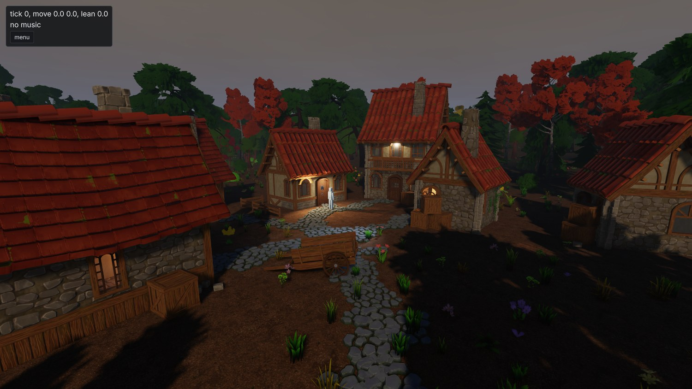

_Storm. Ten conditions, all zero by default: cloud cover, cirrus, precipitation, temperature, wind
direction and speed, gustiness, haze, wetness and snow cover._

The obvious alternative was a Markov chain stepped on the tick. That gets you hysteresis and easy event
coupling. It also loses all three properties above, so I rejected it. Scripted weather uses override
windows: a span of game hours with a ramp either side and a full set of target conditions.
Transitions use the same mechanism. Asking for "storm, over two hours" writes storm into the current
state and puts a window holding the _previous_ weather next to it. That window is positioned so it's
already ramping out. The frame decays from the old weather to the new one and the window then
contributes nothing.

Wetness and snow cover follow the same rule. They're what precipitation leaves behind, computed as
backward integrals over the pattern. Wetness looks back over a nine-hour exponential window. Snow looks back over sixty hours, counting only
what fell below one degree and melting against the current temperature. That costs a few dozen noise
evaluations per query and weather stays stateless.

On the rendering side there's one composed weather map. The cloud trace, the shadow march and everything
downstream all read it. Precipitation is derived from the composed coverage, so rain falls out of the
thick part of the sky. The dark cloud is overhead exactly where the rain is, and that rule exists in one
place.

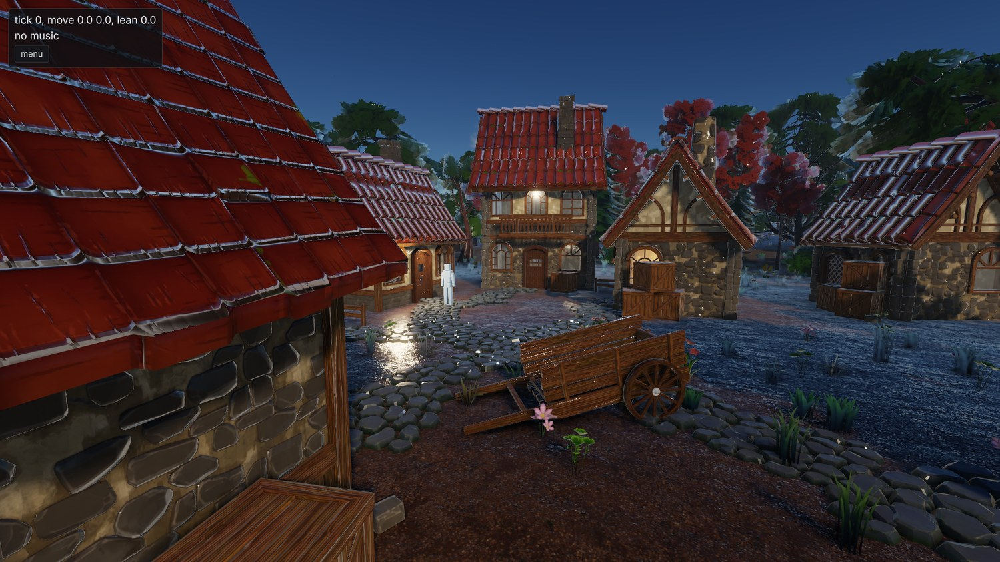

_Wet. Lagarde's recipe, unmodified. Porosity is derived from roughness and metalness, roughness collapses
toward 0.1 and the dielectric f0 moves toward water's 0.02. At full wetness a rough surface's albedo
drops to a fifth of what it was. That's stronger than I expected. It's also what the paper says._

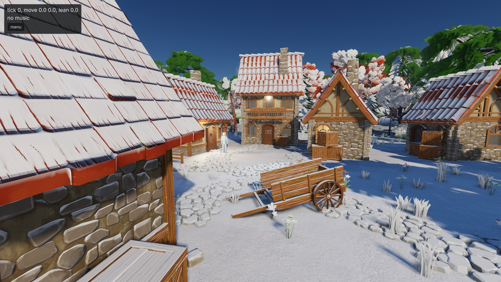

_Snow. Just a dusting. Coverage is keyed on upward-facing normals and the grains are hashed in world
space so they don't crawl with the camera._

Both of those need to know how sheltered a surface is, and that already existed in the alpha channel of
the occlusion attachment, which holds the sky-visibility field's per-pixel result. So wetness and snow
needed no new render targets. The whole surface response costs 0.0015 ms of a 3.37 ms scene pass, which
is below what I can measure.

Two things I would have got wrong without measuring:

- Puddles were going to be a mask off the curvature the terrain splat already computes. The demo basin
  is flat inside the village and its hills are sinusoids hundreds of metres across. Peak curvature is
  about 0.003 per metre. A mask loose enough to catch those hollows floods whole hillsides. Tighten it
  and it catches nothing. Puddles need metre-scale relief or hand placement, and either way that's a
  content decision. So, no puddles yet.
- The haze layer used earth's Mie scale height of 1200 m. At that height haze reddens the sun long before
  it hazes the view. Two hundredths of view-side optical depth cost the sun 56% of its red. At 60 m the
  same sweep costs the sun nothing measurable. The village now has a shallow haze layer and the plain
  exponential fog stays.

## Trees that bend like trees

Wind came in at the same time. It started out as a property of the cloud layer, which I only discovered
when I couldn't find it in the editor. Plants need wind whether or not there are clouds, so it got
hoisted up to the sky component.

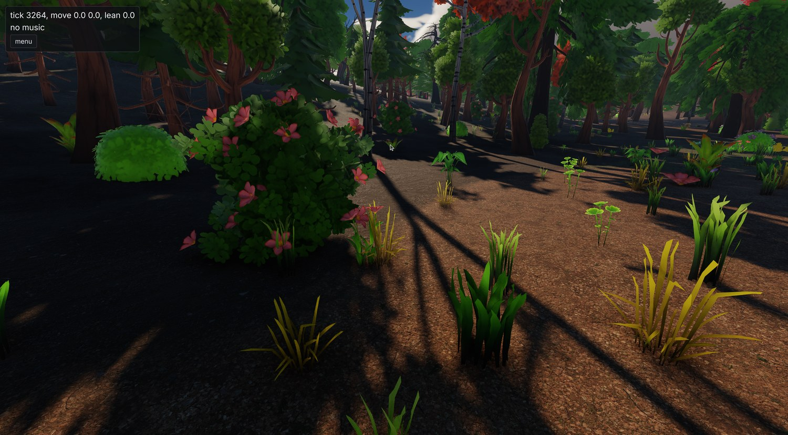

_The wood after the wind work. An actual editor screenshot this time, taken while I was fiddling with
the wind speed._

The bend is computed in the one function every pass uses to get an instance's position. The scene pass,
the depth prepass, the shadow atlas and the sky-visibility field therefore all agree about it. Otherwise
you get a tree casting the shadow of a tree standing still next to it.

Wood and leaves bend differently. The material decides which is which: anything with transmission or a
cutout is foliage and everything else is wood. Wood stiffens toward the model's vertical axis, so the
trunk holds its line and the branch tips do the moving. The first version didn't do that. A whole tree
sheared over as one curve and looked like rubber. Grass needed a second go too. The first attempt looked
like seaweed underwater, because the flutter was hashed from all three axes of the vertex position and
neighbouring vertices got opposite phases. It's hashed from where the card meets the ground now, so a
blade moves as one piece.

How far a plant bends is a property of the plant. `sway` is a key in the model's import sidecar and it
defaults to rigid. The cook can't tell a sapling from a boulder and a swaying rock is worse than a still
tree. Shadows follow the bend out to a distance set by the quality tier and freeze past it, since a bend
doesn't move the transform and a shadow tile caches on the transform.

## A rendering lab

The demo village had collected a bunch of oddly placed lights that existed only to give the golden images
something to test. It also had a row of material spheres, which have no business in a village. All of
that moved out to `lab.scene`, along with the goldens that use it.

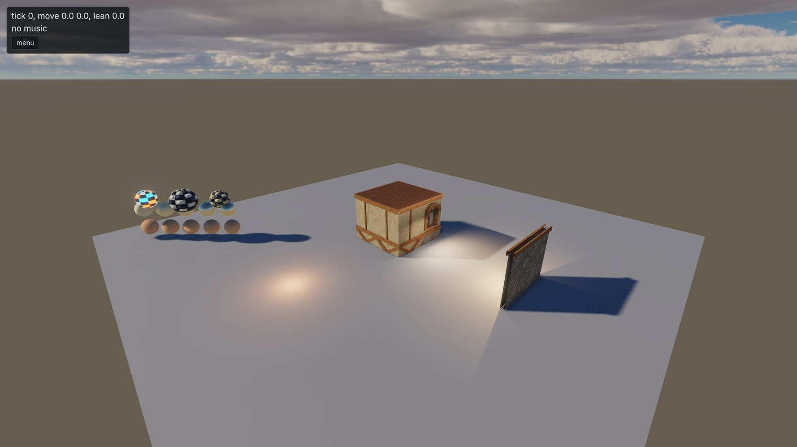

_The lab. Material spheres, area lights, a window-occlusion bay and a lantern bay. Nothing here is trying
to look nice._

Obvious in hindsight. A test scene can be as ugly as it likes and the demo scene gets to go back to
being content.

## The goldens were eating the repo

A push that touched the golden baselines had started taking minutes. So had a fresh clone. When I
finally looked, `.git` was 815 MB. 261.6 MiB of that was `tests/visual_tests/baselines`: 306 distinct
blobs at about 7 revisions each. `demo_scene.png` alone accounted for 53.5 MiB across 18 revisions. Not
ideal.

Three things changed:

- I rewrote the history. Backed up the repo, stripped every superseded baseline revision, force-pushed.
  `.git` is 35 MB afterwards and so is a clone. I don't want to do that again. There's a written plan
  for the images to leave git entirely (a zip pinned by hash and fetched at configure time, like the
  asset packs) but I haven't decided on it yet.
- PNG encoding now goes through libdeflate. stb's PNG writer emits a single fixed-Huffman block, so no
  compression level ever gets you a dynamic table. Hooked in underneath stb's writer, libdeflate took
  41.6% off the golden set. Every screenshot and issue bundle gets the same treatment.
- The baseline recorder now holds any case whose frame moved by less than the comparator can see.
  Before, a re-record rewrote every case whose bytes differed at all. A change that shifted every frame
  by a sub-quantum rewrote 20 MiB of images nobody could tell apart. Now a case is only rewritten if it
  would fail, and the recorder tells you: `4 of 54 held: moved by too little for any case to see`.

@inline_success **Pro-tip:** If your golden images live in git, don't let byte-exactness decide when one
gets re-recorded. If a human can't tell two frames apart they shouldn't cost a megabyte of history. Your
comparator already knows what "can't tell apart" means, because that's the threshold it fails on.

## TAA, after all

The plans had developed a habit. Every few pages there'd be a line like "no TAA means..." followed by a
workaround. That was never a decision I made. It fell out of the early planning, when everything was
sized against a demo scene and one art style, and I'd pushed back on it more than once without settling
it. So I did the honest assessment, for and against, and then read
[elopezr's post on TAA](https://www.elopezr.com/temporal-aa-and-the-quest-for-the-holy-trail/), which
made the case a lot stronger.

The short version: MSAA cost scales with samples times pixels. The machine the quality tiers exist for is
a Meteor Lake laptop with an iGPU, and it can't afford four samples at any resolution worth playing at. A
single history can serve every pass that wants one. The cloud reconstruction already had a private
history of its own, and each new stochastic pass would have wanted another. And a canopy of alpha-tested
leaf cards at one sample degenerates into a binary test that chequers. Temporal integration is the fix
for that.

So, settled. What went in:

- Halton (2, 3) jitter over eight frames, driven off the renderer's frame counter so an offscreen
  screenshot at a given frame count is still byte-identical every run.
- A motion vector attachment written only by things the camera doesn't explain: a model whose transform
  changed, a skinned draw, a swaying instance. Everything else writes an infinity meaning "reproject me
  by depth". Terrain, impostors and unmoved models pay nothing in the vertex stage.
- The resolve: velocity dilated to the nearest depth over a 3x3, a five-tap Catmull-Rom history fetch,
  and variance clipping at 1.25 sigma intersected with the neighbourhood's min and max. All of it in
  Karis's luminance-weighted space using exposed values. A moonlit frame is four orders of magnitude
  darker than noon and a weight on raw values does nothing at night.
- Disocclusion is a velocity rejection. The difference between this frame's velocity and last frame's at
  the reprojected position decides how much history to keep.
- At one sample, MASK materials swap alpha-to-coverage for a hashed alpha test seeded per frame. The
  history integrates the threshold back into a coverage, and that alone removes a third of the
  chequering.

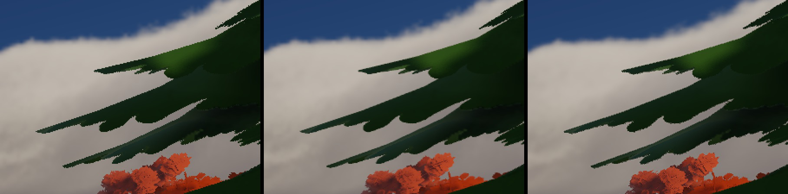

_The same pine at one sample, at 4x MSAA, and at one sample with the temporal pass. 2x nearest-neighbour
crops. The third is cheaper than the second._

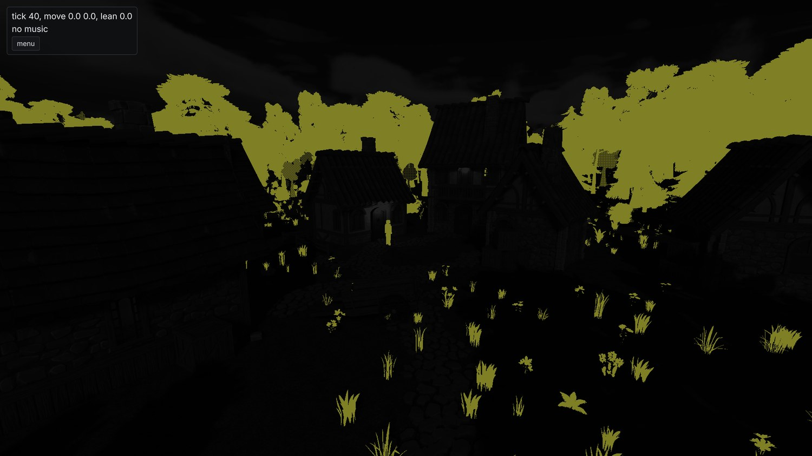

_The `taa_motion` debug view. It shows the motion a surface reports beyond the camera's. Static geometry
is black and the swaying canopy is the only thing writing velocity in a still frame._

Cost on the 3070 at 1080p, all four arms in one process:

| arm              | frame    | scene    | taa      |
| ---------------- | -------- | -------- | -------- |
| 4x msaa, no taa  | 7.212 ms | 3.425 ms |          |
| 4x msaa + taa    | 7.608 ms | 3.602 ms | 0.183 ms |
| 1 sample, no taa | 6.187 ms | 2.680 ms |          |
| 1 sample + taa   | 6.488 ms | 2.864 ms | 0.183 ms |

The resolve costing the same at both sample counts is a sanity check. It runs over the resolved image,
so it can't depend on how many samples produced it. One sample with the pass on is 0.72 ms cheaper than
four samples with it off. That's the trade the quality tiers now make. Every tier has TAA on. `low` and
`medium` render one sample and `high` keeps two for the hard edges a history can't help with. I decided
those rows on the laptop, where the differences are several times larger and easier to read.

Three things from tuning it:

The jitter period. I measured periods of four, eight, sixteen and thirty-two frames, and the first two
attempts were wrong in ways that looked like results. An unjittered one-sample frame is _identical_ to
the MSAA one on every fully covered pixel, and that's 99% of them. Compare whole frames and any jitter
scores as pure loss. Compared only over the 0.96% of pixels that MSAA changes:

| period | edge distance to msaa |
| -----: | --------------------: |
|      4 |                  7.95 |
|      8 |                  6.19 |
|     16 |                  6.22 |
|     32 |                  6.01 |

One sample with no history scores 11.34 on that set, so the pass removes about 45% of the aliasing. Past
eight frames the edges stop improving while the texture blur keeps growing. Eight it is.

The sharpener. Early on, the one-sample temporal frame measured _worse_ for chequering than the plain
one-sample frame. RCAS runs at native resolution whenever TAA is on. It was running at the setting tuned
for the upscaling path, where EASU has already softened the frame. At native there's nothing to recover.
It was undoing the antialiasing the pass had just done. Sweeping the sharpness from 0.2 to 1.0 took the
chequered share from 0.167% to 0.068%, under the plain lattice's 0.084%.

And the overlays. The debug grid and lines were being drawn inside the history. A line averaged over
eight sub-pixel positions loses a third of its peak contrast (163 against 214). They draw after the
tonemap now.

@inline_attention **A knob tuned for one frame is wrong for another, and nothing tells you.** The
sharpener had a perfectly good default. It was the default for a frame that had been through a
different pipeline, and it had a measurement behind it, so nobody questioned it.

## A flag day for Vulkan

While writing the water plan I kept hitting the same wall. SDL_GPU's binding model is slot-bound at
DX11 counts: sixteen samplers, eight storage buffers, eight storage textures and four uniform blocks
per shader stage. The shared surface header was already at fifteen samplers and eight of eight storage
buffers. The terrain's layer table was a 4 KiB uniform block because there is no ninth storage buffer.
The cloud shadow map and the aerial transmittance were hand-filtered buffers because the sampler that
would have held them doesn't exist either. The water plan was spending a page working out how to fit its
field, its caustic map and its reflection march into the one slot left.

There were other walls too. You can't read a multisampled texture at all, which is why the frame stored
depth three times and why the fork carried a depth-resolve patch. The fork itself was four patches to
rebase onto every SDL bump. And SDL_GPU has no indirect count and no draw parameters, so every cull and
every LOD selection was CPU work over every resident entity. That's the work week 4 threw a job system
at.

The week before all this, Sebastian Aaltonen had put out
[NoGraphicsAPI](https://github.com/sebbbi/NoGraphicsAPI). It's about 3700 lines and it's exactly the
shape I wanted: memory as GPU pointers, one application-owned descriptor heap, a push-constant root per
draw, global barriers, timeline completion. It's also a prototype by its own README. It needs four
extensions beyond core 1.4 and neither of my GPUs has three of them. So I copied the shape and wrote my
own.

The decisions took one evening. Our own backend. A flag day, with no transition period and no SDL_GPU
fallback. A library between the platform layer and the engine. volk and VMA, because a loader and a
suballocator are the two parts of a device layer that always cost more than they look. macOS dropped.
And the floor at Vulkan 1.4, because both my drivers were already there. 1.4 doesn't ask anything of the
hardware that 1.3 didn't. It's a driver floor, roughly everything from early 2025 on.

### The shape of it

- Memory is addresses. Every storage buffer and uniform block is memory the shader reaches through a
  typed pointer in scalar layout, mirrored by the same C++ struct. None of it costs a binding.
- One descriptor set is the heap: runtime-sized, partially-bound, update-after-bind arrays, one per
  view type. A texture is a 32-bit index from a free list. Every pipeline in the engine uses the same
  layout.
- The root is a 256-byte push-constant block holding pointers to the frame, the pass, the material, the
  object and the instance rows. What SDL_GPU needed forty-six uniform pushes for is now one struct per
  draw.
- Geometry is one arena per buffer type, sub-allocated through VMA's virtual allocator. A draw is a first
  index and a vertex base, so any subset of the tree can be drawn from one command.
- A vertex is a load. There's no vertex input state anywhere. The vertex stage reads its vertex through
  a pointer at base plus index.
- A draw list is memory: draw records next to indexed indirect commands and a count, consumed by one
  `vkCmdDrawIndexedIndirectCount` per pipeline and written by a compute cull.
- Barriers are global. One memory barrier per pass edge. Attachments are the only exception and
  everything else stays in `GENERAL`.
- Completion is a timeline. One queue, one timeline semaphore, and every destruction deferred to the
  timeline value that last used it.

### Stage A: the layer, and the tests that found it

The layer went in first as a library nothing linked yet. Every test case creates its own device and
fails on any validation error _or warning_, with synchronisation validation on. 34 cases, 27,445
assertions, zero validation messages. Nine bugs came out on the way to zero, six of them in the layer:

1. The heap descriptor set was never bound. `vkCmdBindDescriptorSets` didn't appear anywhere in the
   library. Every test passed anyway, because none of them had read through the heap. The first one that
   did segfaulted.
2. No texture was ever transitioned to `GENERAL`, so the first read through a heap slot was undefined
   behaviour.
3. Heap slot 0 could be released and never come back. The deferral early-returned on a zero handle.
   That's right for a Vulkan object, but index zero is a valid slot.
4. A resource dropped mid-recording was deferred against the previous submit.
5. A write-after-write hazard on a depth resolve target.
6. A sampler asked for anisotropy the device supported but hadn't been created with. Only what was
   _enabled_ counts.

None of those would have produced a wrong image on my hardware. The next round found seven more. Four of
those no validation layer can see: multi-draw indirect issued without the feature enabled, a depth clear
and a depth test that cancelled each other out so the test passed everything, a shadow sampler comparing
the wrong way under reverse-Z, and no way to spell an index-buffer barrier. Fun.

@inline_success **Pro-tip:** A device layer's tests should create a real device and fail on validation
_warnings_. Most of the thirteen defects above would have rendered a perfectly plausible image on the
hardware they were written on. Validation is the only oracle that doesn't need a wrong pixel to point
at.

### Stage B: the port

The port itself took four days of checkpoint commits, squashed once the goldens were green. The
renderer, the engine, every shader, the CPU cull and the editor's imgui backend all moved together. At
no point did the tree hold two binding models. The rule for the whole stretch was "forget SDL_GPU ever
existed, including the silly workarounds".

A few things changed under cover of the rewrite. Reverse-Z throughout. An imgui backend of our own over
the heap, because the stock Vulkan one submits and idles the whole queue every time imgui rasterises a
glyph. The object id attachment became an entity key in a `uint` format. And frames-in-flight became a
measured number. A flat-out bounded run gets two, where the second frame gains 1.34 ms of a 9.31 ms
frame. A paced windowed session gets one, because the loop sleeps out the slack anyway.

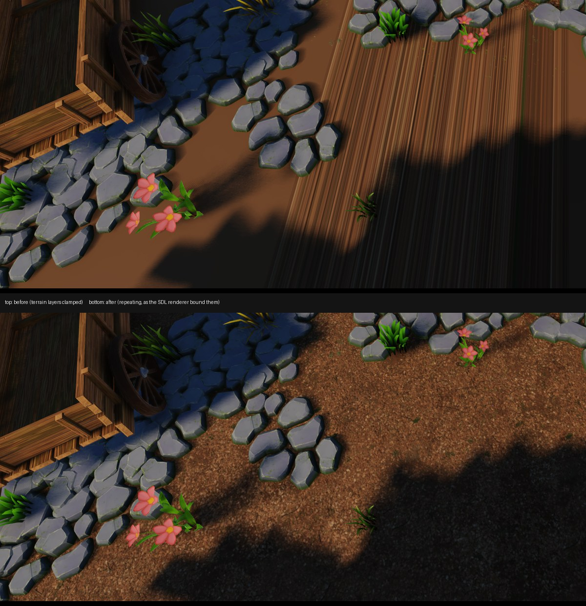

_One of the port's bugs. The terrain layers were sampled with a clamping sampler where the old backend
had used a repeating one, so every ground texture past its first tile smeared into streaks. A golden
image catches this in seconds._

The golden suite was the method. Halfway through the port it was at 52 of 84 passing. By the end one
defect accounted for 27 of the last 29 failures: a band of blown-out pixels down the right edge of every
lavapipe frame. Its value depended on device memory the image didn't own. Moving model geometry between
arenas changed no pixels on the 3070 and 287 on lavapipe, all in the last ten columns. The margin of a
render target outside its drawn sub-rect had never been defined. Defining it fixed the band. It also
turned up depth images being cleared through a colour-clear call that lavapipe implements as a null
function pointer. Lovely.

The fork got retired partway through, once the layer had its own timestamps, native handles, depth
resolve and barrier fix. The SDL recipe now pins stock SDL at the exact commit the fork had been rebased
onto. Nothing in the tree patches a dependency any more.

Then a full re-record, with the six still-failing cases spot-checked by eye. The perceptual hold from the
goldens section left four of them alone. The squashed diff is 335 files, 40,501 insertions and 13,361
deletions.

### Stage C: the frame the GPU drives

Stage C is the reason for doing the port. It's everything the old binding model made impossible.

A compute cull now writes every draw list in the frame. One lane per (view, item) pair rejects against
the view's frustum, picks the LOD level and its fades, and emits a sort key. A compaction removes the
empty slots. A radix sort orders what's left. A run merge turns the sorted keys into indirect commands
and draw records. Slots are assigned by prefix sum, so the draw order is a pure function of the input
and doesn't depend on which workgroup ran first. The CPU draw list the whole thing was validated against got deleted once
nothing drew from it. Sizing each pair's reservation to what its model can emit took the demo's
reservation from 33,264 slots to 5,278 for the same 2,456 entries. Waste is a bug with extra steps.

Two-phase occlusion culling runs in the same cull, against a depth pyramid built from the frame's depth.
Phase one tests against last frame's pyramid and marks its rejects. Phase two re-tests the rejects
against this frame's pyramid and draws whatever turned out to be visible.

The village couldn't test any of this. Its frame is fragment-bound and the frustum already keeps most of
what's resident. Even a perfect occluder would only remove a fraction of the triangles. So, a new scene:

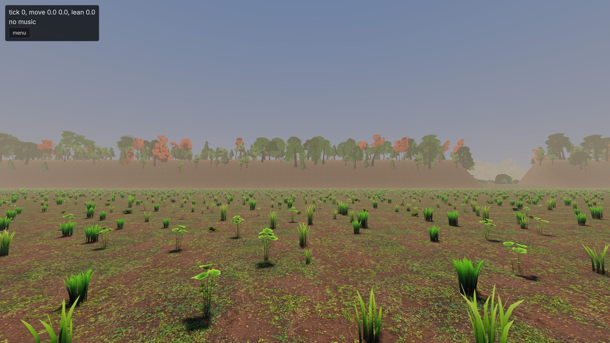

_`ridge.scene`, built for occlusion. A grassy shelf, a ridge across it with one notch, a wooded basin
just behind the crest and a wall further back. 30,000 scatter instances and 15,800 trees, against the
village's 2,800 and 500. My first version had the ridge 60 m high and measured 3.9%, the same as the
village. It only hid things far enough away that the LOD chain had already made them cheap._

From the shelf at 1280x720:

| occlusion | triangles | instances | frame   |
| --------- | --------: | --------: | ------- |
| off       |   496,156 |    17,181 | 4.92 ms |
| on        |   270,875 |     2,763 | 3.86 ms |

21.6% of the frame, and the image difference is smaller than the difference between two runs of the
same arm. Cascades also drop casters whose shadow lands on nothing the camera can see. On the village
under a moving sun that takes the atlas from 1.82 ms to 1.63 and the cull from 0.97 to 0.62, for a mask
costing 0.08.

Then clusters. Each cooked LOD level gets cut into clusters of at most 124 triangles at cook time, each
with a bounding sphere and a normal cone. The frame then has three ways to get geometry to the
rasteriser. The cooked index ranges as they are. A compute pass that copies each surviving cluster's
triangles into a window of the index arena. Or a mesh shader that emits a surviving cluster from one
word. On the ridge's shelf at 1080p:

| front end | scene    | prepass  | cull     | frame    |
| --------- | -------- | -------- | -------- | -------- |
| indices   | 4.361 ms | 1.286 ms | 0.617 ms | 8.609 ms |
| expansion | 3.494 ms | 0.707 ms | 0.919 ms | 7.456 ms |
| mesh      | 3.498 ms | 0.685 ms | 0.688 ms | 7.207 ms |

Both cluster arms take the same amount off the scene pass and the prepass. The difference is entirely
the cull row, because writing one word per cluster is much cheaper than writing its hundred-odd indices.
The expansion also asks for 8.7 million words against a 7.5 million ceiling and overflows, so the draws
that don't fit get drawn unculled. The mesh arm asks for 75,920. On the village neither one pays off,
since the triangles a cull removes were dying to early-z anyway.

Mesh shaders are optional in Vulkan, and lavapipe emulates the stage badly enough that the golden suite
more than doubled in length on that arm. The default is `automatic`: mesh shaders where the device has
the extension and isn't a CPU rasteriser, cooked ranges otherwise.

The terrain clipmap's patch selection moved to the GPU as well, and the terrain draws became indirect
with it. That produced the best bug of the fortnight. An indirect draw may not use a non-zero
`firstInstance` unless the device was created with that feature, which it never is. The scene's job came
first in the buffer with a base of zero, so every scene image was correct. Only the sky-visibility map
and the shadow cascades drew whichever patches they felt like. Two goldens caught it. The other 86
couldn't see it. Neither can validation, because the value is written into device memory by a shader.

Some smaller things fell out of the same fortnight. The multisampled distance attachment got deleted
(33.75 MiB at 1080p and 4x) once every screen-space reader learned to unproject depth itself. And the
pipeline cache turned out to be a cost: a 688 MiB blob taking startup to 3.75 s, against 2.98 s with no
cache at all and 1.71 s with the 37 MiB that one session writes. Oh. It has a size limit now.

### What a 4K frame costs

With the CPU out of the frame, the next question was what the GPU spends it on. At 3840x2160 on the
demo scene, `high` is 20.18 ms, `medium` 13.93 and `low` 7.91. One sample at 85% of the window already
clears 60 fps with room to spare. `high` misses it by 3.5 ms. At that resolution the cost is shading.
The scene pass is 9.98 ms shaded and 1.50 ms unshaded, drawing the same fragments into the same
attachments.

Splitting the shaded 10 ms:

| term                       | ms   | share |
| -------------------------- | ---- | ----- |
| raster and the attachments | 1.50 | 15%   |
| the cascades               | 2.29 | 23%   |
| the contact march          | 1.18 | 12%   |
| the clustered light loop   | 0.64 | 6%    |
| the ambient                | 0.56 | 6%    |
| the sun's brdf             | 0.17 | 2%    |
| fog                        | 0.28 | 3%    |
| sky and cloud compose      | 0.10 | 1%    |
| specular aa                | 0.08 | 1%    |

Shadows are a third of it between them. The lighting maths is about 15%. What's left after every row,
about 3.1 ms, is material sampling: the texture fetches, the tangent frame rebuilt per fragment, and the
weather terms on top. That's the largest single item in a shaded fragment. I suspect that's where the
next real win is. Next time.

## Clouds, again

The cloud deck from week 4 got two fixes and one verdict. The horizon was being sampled 45 times more
coarsely than the zenith on the same step budget, because a grazing ray spans the full 90 km reach and a
vertical one only spans the layer's thickness. The march budget now scales with the ray's span over the
thickness, capped at 2x. And a render-scale change was resetting the cloud history 36 times over six
steps because the history was reprojected through the wrong extent. Once, now.

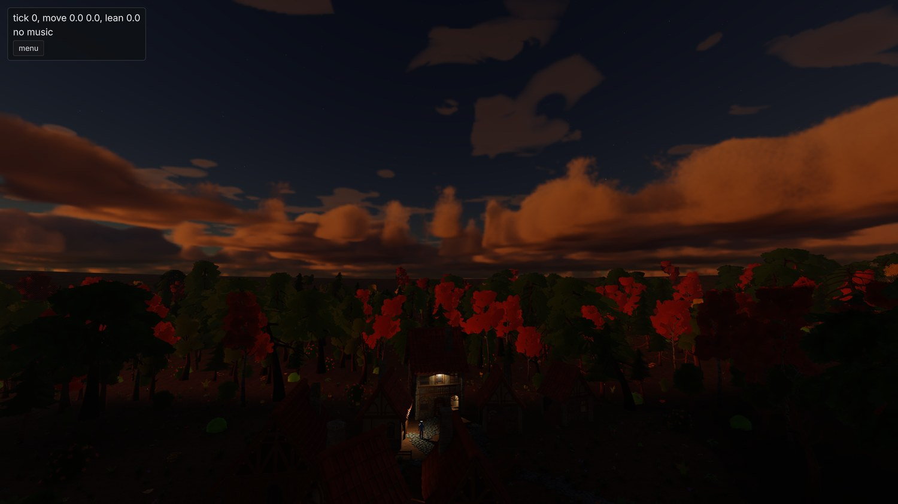

_Late evening, before either fix. I still think they look like a skybox._

The verdict is that they're not good enough. They look like a painted dome from most angles and worse at
the horizon. Other engines have real volumetric clouds at good frame rates. The early passes at this were
sized to the demo scene, which is the mistake this project keeps making. There's a proper plan now and
it's next on the renderer's list after water is drawn.

## A day of planning

Between the port and the water, one whole day went on plans. Every remaining work order got the same
treatment: water, foliage, weather, precipitation, the scale-and-photoreal survey and what was left of
stylization. Most had been sized to the demo scene without anyone saying so. Each one got reviewed
against best practice and fleshed out until it could be implemented without redoing the research. Then I
settled every open question in one sitting. Six plans, no open questions left.

## Water, part 1

The first customer for water is a lake. Seen from its bank and from a glide, with the village on the
shore and a river feeding it. Part 1 is everything a body of water needs before any of it gets drawn.

A terrain document now holds its bodies of water alongside its material and scatter layers. The cook
derives a field from them on the same grid as the heightfield: the still surface height, the current,
which body a sample belongs to, and from those the depth and a signed distance to the shore. There's no
separate `.water` asset. The carve, the depth masks and the placement rules all need the ground and the
water in one pass.

Three kinds of body, each authored with the least information that determines it. A lake is a seed
point and a level, flooded out from the seed over every connected sample below the level. A river is a
list of points, each with a surface height, a width, a depth and a speed, joined by a centripetal
Catmull-Rom spline. The bed is carved to a parabolic profile under a blended bank and the current runs
along the tangent. A sea is a level, flooded inward from every boundary sample below it. The carve is
derived at cook time and isn't saved in the document. It applies above the base raster but below the
sculpt layers, so a ford you raised by hand sits on top of a carved bed.

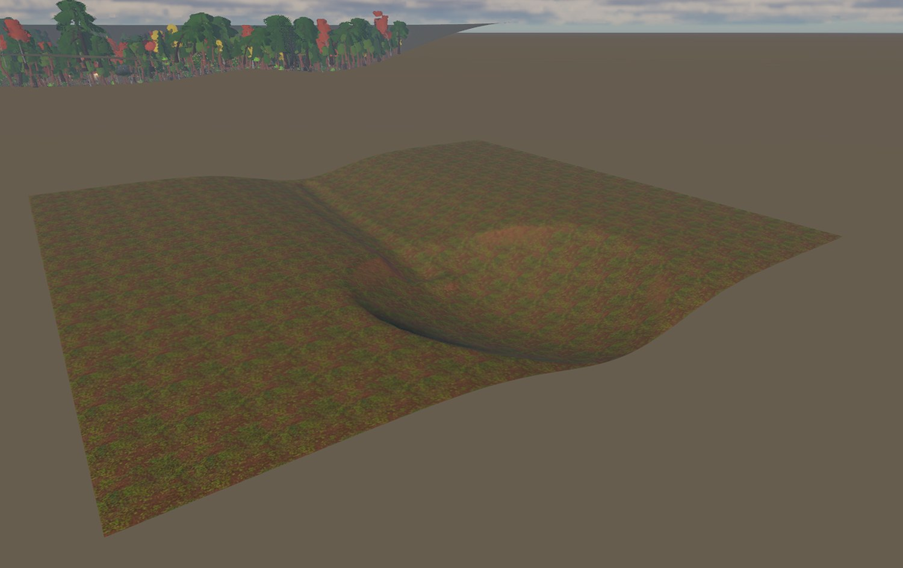

_The water fixture, stood next to the demo basin. The stream bed is carved down the valley into the
pond bowl, and there's no water in either of them yet. The cook reports the pond at 253.5 square
metres and two metres deep, and the stream at 116 square metres and 0.6 m deep at its centre._

Every placement rule takes a depth window and a shore window now. Reeds grow in the shallows and a wood
keeps a few metres back from a bank. The picker's ray marches the water field the same way it marches
the ground. The character controller wades and swims, with gravity replaced by a damper toward an
authored swim depth. `water_at` crossed the C ABI waist as one call returning four floats and a body
index. My favourite number: a ray cast onto the pond lands 1.997 m above where the same ray lands with
water ignored, which is exactly the depth the field reports at that point. Two code paths that share
nothing past the field.

There's no surface yet. Nothing is drawn, and no golden moved. A 150-tick swim replays digest for
digest. Part 2 is the surface.

## Where it stands

The engine has weather, a temporal pass, its own device layer with a GPU-driven frame, and half of
water.

Next is water's surface, then the clouds, then skinning in compute. The traversal slice is still what
all of this is for, and it still hasn't started.

## Credits

Everything in these shots that isn't engine is bought or borrowed:

- The buildings, props, trees, foliage and rocks are [Quaternius](https://quaternius.com/) kits: the
    Medieval Village and Stylized Nature MegaKits, bought as the paid source versions, plus the free
    Ultimate Stylized Nature set. All of it is released CC0, and he takes Patreon support.

- The ground materials are [Poly Haven](https://polyhaven.com/) textures, CC0.

- The type is [Inter](https://rsms.me/inter/) by Rasmus Andersson, under the SIL Open Font License.
